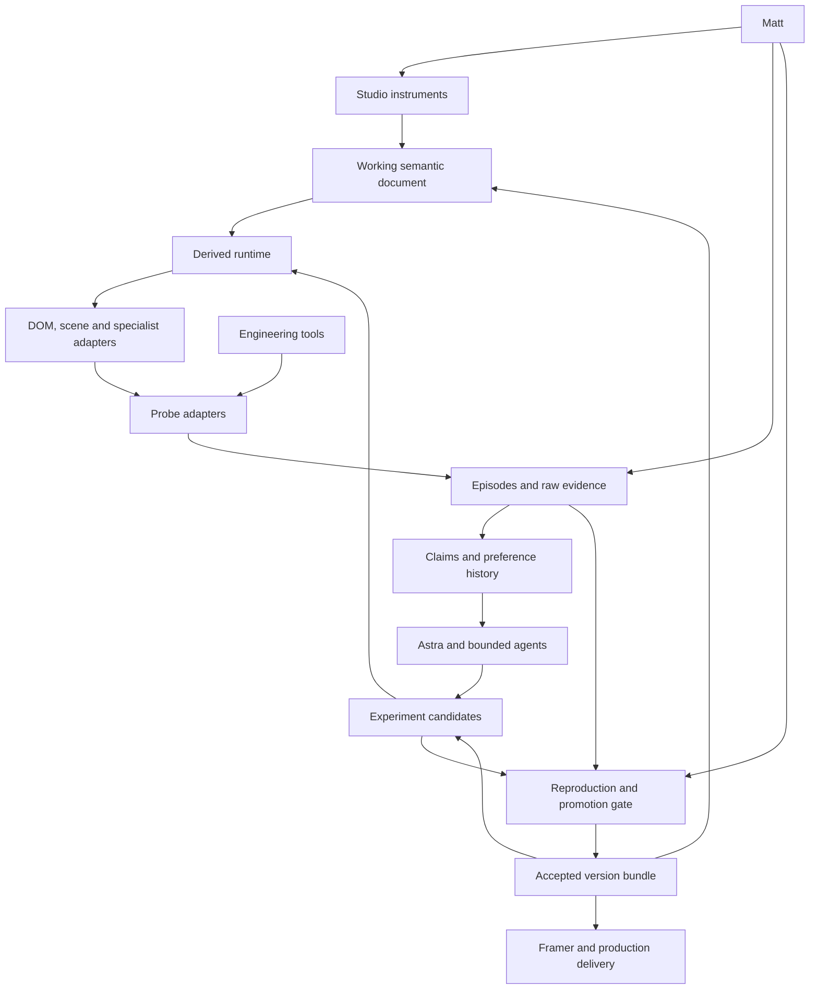
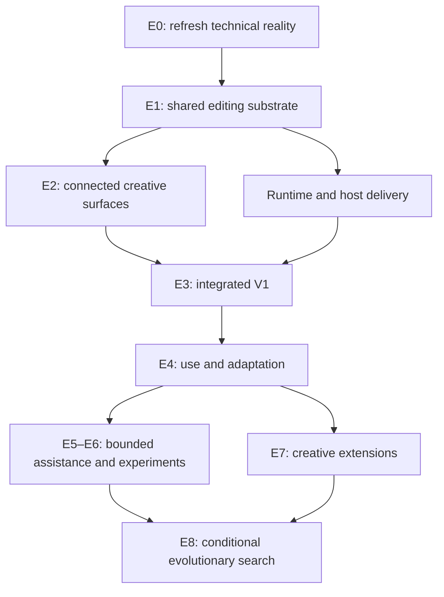

# iGlass Composition Studio — authoritative master build plan

**Decision edition: 28 September 2026**  
**Status: adopted specification and execution plan. Broad integrated V1 is BUILD_NOW.**

This consolidated plan replaces the previous execution sequence and the separate strategy reassessment. It preserves the established authoring, runtime, creative, evidence, experimental, knowledge, island, recombination and promotion architecture. Superseded one-instrument release gates and calendar allocations have been removed. No other document is needed to decide which build strategy is operative.

**Quick navigation:** [Direction](#1-executive-direction) · [Creative scope](#46-integrated-v1-workspace) · [Architecture](#2-revised-ontology-and-complete-architecture) · [Commitments](#18-operative-subsystem-commitment-matrix) · [Sequence](#19-authoritative-execution-sequence) · [Ownership](#21-delegation-interfaces-and-integration-ownership) · [Acceptance](#23-integrated-v1-acceptance-and-later-expansion).

## 1. Executive direction

Build an integrated personal visual composition environment where Matt discovers layout, copy, DOM/2D/3D relationships, appearance, motion and responsive art direction through direct manipulation. AI builds and adapts the machinery; Matt retains perceptual authority. The architecture should let accepted compositions and instruments be pruned, reshaped and extended without losing their meaning or history.

Product definition is mature enough for a broad V1. Interaction representations and integration details remain subject to use and testing. This is a reason to build a recoverable, inspectable workspace, not to rediscover each documented requirement through one Hero task at a time.

Adopt four responsibilities—create, observe, experiment, remember/promote—in one application and a small local service. Shared document identity, commands, ownership, persistence and export are early technical dependencies. Complete replay, a universal runtime graph and an autonomous laboratory are not.

The first release spans seven connected surfaces: composition; copy; components; scene/appearance; pose/path/choreography; responsive art direction; Takes/comparison/discovery. Build them through small integrated changes. A first end-to-end command is an internal foundation check, not the intended product release.

The existing Hero works and Matt is happy with its result. Preserve it as an accepted system, reusable machinery and a regression fixture. Validate the Studio against it and other composition classes. Do not assume it needs repair, redesign or a new pain-point interview.

### 1.1 Technical baseline and evidence status

The 20 September E0 record matched repository `playwithlifenow-eng/IphoneAnimation`, deployed commit `ef3850a8d74619c99ac79eb833eeb31e86ef8dad`, scene version `7.5.51-mobile-headline-telemetry`, bundle `main.093a9d53.js`, Framer driver `HeroGlassDriver_RoutingTest.tsx` / `tBiC48I`, published driver revision `jXFO4ylVFxiwo7N112SX`, page `kjakVFRx4`, Vercel deployment `dpl_ikaFDQyfu9vG1PNUMRV6owLqZB3J`, 130 saved controls per breakpoint and the primary GLB.

The source repository was cloned for this implementation on 28 September and its HEAD still matches that recorded commit. This establishes source continuity, not a fresh claim that every current host setting or deployment is identical.

| Evidence / boundary | Consequence |
|---|---|
| Historical host: `https://iglassmobilephonerepairs.framer.website/hero-driver-routing-test`; scene: `https://iphone-animation-five.vercel.app/` | Preserve host/scene distinction and versioned protocol |
| Primary `14_pro_oled_repaired.glb`: historical served/Git match, 4,876,456 bytes | Reuse the repository asset and retain identity |
| Current package preserves React 18.2.0, R3F 8.15.16, Drei 9.88.0, Three 0.158.0, GSAP 3.12.5, Leva 0.10.1 and react-scripts 5.0.1 | Keep the functioning Hero dependency environment intact; isolate Studio build tooling |
| Two breakpoint property sets and four motion documents; similarly named desktop paths differ | Preserve exact authored documents rather than normalising by name |
| Framer properties switch at 1200px; scene path is selected by stage aspect; headline mode also uses hardware input traits | Treat these as distinct rules, not a single universal mobile flag |
| Historical cloud session did not create a scene canvas; WebGL capability gating was a possible cause | Do not claim a live Hero defect or change production to suit that environment |
| Framer/Vercel access was not usable in the reassessment | Continue independent implementation; retry only for a task requiring those services |
| Complete texture/environment/font verification and independent historical rebuild were unfinished | Record scoped coverage; validate dependencies actually used by each implementation fixture |

Earlier 19 September archive/source observations remain historical evidence, not an alternative current baseline. In particular, the archived 7.5.45 geometry payload differed from the newer host contract, while the matched deployed 7.5.51 bundle contained physical geometry. Do not resurrect the archive mismatch as a current bug.

### 1.2 Implementation doctrine and decisions

- Use the complete product specification as the primary brief. Consult history selectively for missing source, exact decisions or regression cases.
- Build broad creative scope with small implementation increments, stable interfaces and frequent integration.
- Preserve a single authoritative semantic document; derived runtime, observation and experimental copies do not gain competing authority.
- Choose reasonable reversible defaults. Ask Matt only when a decision materially changes the objective/product, is costly to reverse, or needs specific information unavailable from accessible evidence.
- Keep feedback and basic evidence native. Expand capture depth when an actual question needs it.
- Preserve all long-term evolutionary mechanisms as explicitly conditional phases; do not make them prerequisites to the creative workspace.
- A blocked service limits its specific task. It does not halt unrelated Studio development.

## 2. Revised ontology and complete architecture

The proposed four-system ontology is useful **as a division of responsibility**. Treating it as four independent engines would create duplicated state, integration cost and an observability product larger than the creative tool.

| Responsibility | Main question | Initial implementation |
|---|---|---|
| Creative instrument | Can Matt express and compare the intended result directly? | Canvas, contextual tools, semantic document, commands, preview and takes |
| Observation and evidence | What happened, in which exact state, and what can we actually know? | Typed probe adapters, bounded buffers, Evaluate, episode export and evidence queries |
| Experiments | Which small change would resolve this uncertainty? | Pinned candidate, declared hypothesis, existing test runner, matched comparison |
| Knowledge and promotion | What was learned, where does it apply, and what becomes accepted? | SQLite records, artifacts, decision history and protected accepted references |

“Astra” denotes the architect/integrator and reasoning role. Agents are optional actors in experiments. Tools provide observations and actions. An island is an isolated experimental configuration. None of those is an additional source of truth about the composition.

The architecture below distinguishes authority from derived execution and experimental copies.



There are three operating loops, sharing the same identifiers and evidence:

- **Creative loop:** manipulate → preview → capture reaction → compare takes → accept.
- **Engineering loop:** detect → reproduce → isolate cause → change → verify → integrate.
- **Experimental loop:** identify uncertainty → prepare candidates → collect bounded evidence → interpret → retain or reject a discovery.

Do not force these into one long pipeline. A typography adjustment may need no new mathematical mechanism. A pure serialization repair may need no fresh aesthetic vote. A new camera interaction needs all relevant layers.

### 2.1 Authority boundaries

Maintain four distinct references:

1. **Working document:** editable current composition; gesture previews are transient.
2. **Accepted creative take:** the composition Matt has accepted for a stated context.
3. **Integrated implementation:** reviewed code and contracts passing the required technical gates.
4. **Production release:** a delivered combination of implementation, composition, assets and environment.

“Canonical” means a protected, versioned **accepted bundle**, not a mutable global singleton and not necessarily the latest Git commit. An experiment can read it and derive a child. It cannot replace its accepted pointer.

Matt's normal reversible editing remains fluid. Protection applies to experimental promotion and release, not a confirmation dialog on every creative gesture.

## 3. Authoring representation, instruments and runtime

### 3.1 What Matt should author

The durable document contains concepts meaningful during composition:

- objects and component instances with stable identities;
- content, typography and design tokens;
- poses, paths, named beats, cues and optional time tracks;
- semantic instrument settings and bounded advanced parameters;
- responsive art-direction profiles and scoped overrides;
- signal bindings and explicit modulation relationships;
- relational intent, such as clearance and intentional occlusion;
- quality alternatives and accessibility alternatives;
- references to assets, recipe versions and accepted takes.

A pattern is a reusable **creative arrangement**, such as a reveal, an exploded product explanation or an orbiting title. An instrument is a **way to manipulate** an arrangement or capability. A macro is a semantic mapping from one or more controls to parameters. These are related concepts, not compulsory serialization layers.

Do not require every edit to travel through “macro → pattern → capability → authoring representation.” A direct text edit should update the text. A “Mechanical Weight” macro may drive a response mechanism. A choreography pattern may instantiate several components and instruments.

### 3.2 The hidden runtime

The runtime is a derived evaluation plan. Initially, compilation can mean validated TypeScript functions, subscriptions and ordered adapters—not a compiler framework, bytecode VM or general graph database.

Implement the primitives required by the defined V1 families now; extract further primitives from demonstrated needs. Likely families include values, mappings, interpolation, state transitions, bounded response, time, selections, collections and outputs. That is a working vocabulary, not a fixed primitive count.

Essential runtime properties:

- Explicit types and units: seconds versus milliseconds; CSS pixels versus scene units; normalized progress versus distance; colors with declared interpretation; Euler editing versus quaternion interpolation.
- Explicit coordinate spaces: object, world, camera, normalized viewport, host CSS pixels and iframe-local CSS pixels.
- Stable object and channel IDs. Indices alone cannot identify changing collections.
- Acyclic evaluation for ordinary derived values. Feedback requires an explicit stateful operator, delay or solver with a checkpoint contract.
- Deterministic ordering where the application controls it. Browser scheduling, GPU execution and external inputs remain declared environmental factors.
- Stateful operators serialize the state required to resume, including velocity, phase, accumulators and random seeds where applicable.
- Dormant work can stop. Demand rendering, visibility and quality policy are explicit lifecycle behavior.

Build a read-only “why is this value here?” inspector in V1. It should explain ownership, scope and transformations in ordinary terms, with a dependency graph available for diagnosis. A graph may later be useful inside a specialist instrument; it should not become the default authoring surface.

### 3.3 Commands and direct manipulation

Human tools and authorized agent actions use the same validated command boundary. They do not write arbitrary React state or mutate the runtime behind the document's back.

A gesture has a transaction identity, pre-state, preview overlay, scope and end reason. During a drag, updates affect the preview. A meaningful completed gesture commits one intended transaction. Escape/cancel restores the pre-state and commits none. A no-op commits none. Multi-object operations may deliberately form one transaction. Undo restores document meaning; it does not pretend to reverse external side effects.

The transaction count is **relative to the operation**. The application's entire undo stack is not limited to one entry.

Ownership must be visible:

- base authored value;
- responsive override;
- active cue/track;
- explicit modulation;
- transient gesture overlay;
- effective output.

Use property-specific composition rules. Additive translation, multiplicative scale and quaternion composition are not interchangeable. Reject ambiguous writers rather than silently applying “last update wins.”

When a property is driven, the instrument offers an explicit action such as edit baseline, adjust modulation, record at playhead, create keyframe or detach. A drag must not unpredictably overwrite a signal binding. Non-invertible macros need a defined editing policy; do not invent an inverse from the rendered result.

Interaction design remains research: screen/world/local handles, snapping, precision modifiers, keyboard equivalents, focus behavior, touch targets, selection, cancellation and ownership explanations all require real use. Mechanism tests cannot settle those choices.

### 3.4 Component and instrument contracts

A component exposes capabilities, not its entire implementation.

```yaml
component_contract:
  identity: stable_id_and_version
  inputs: typed_parameters_with_units_ranges_and_defaults
  editable_targets: declared_properties_and_spaces
  outputs: named_signals_and_projectable_anchors
  ownership: supported_drivers_and_composition_rules
  lifecycle: mount_ready_suspend_resume_dispose
  observation: available_probes_and_known_blind_spots
  reproduction: checkpoint_support_and_fidelity_limits
  relationships: supported_relational_predicates
  quality: authored_alternatives_and_switch_constraints
  delivery: supported_hosts_assets_and_dependencies

instrument_contract:
  purpose: creative_task
  representation: handles_controls_and_feedback
  commands: allowed_transactions
  mapping: semantic_parameters_to_capabilities
  scope: selection_responsive_profile_and_time
  iteration_contract: instrument_specific_evidence_and_questions
  capability_envelope: exposed_hidden_possible_and_unknown
```

Implement these narrow shared interfaces across V1 incrementally, with unsupported optional capabilities explicit. A legacy component adapter can declare “no checkpoint support” honestly and use a lower-fidelity replay. It does not need a speculative rewrite before it can join the Studio.

## 4. Creative instruments and the creative ceiling

The Studio's creative ceiling is the range of useful decisions Matt can discover, understand and control. More numerical sliders alone do not raise it.

Every family below includes direct manipulation, objective inspection and its own short subjective evaluation. Show a few relevant questions per episode, with optional deeper questions. Preserve question IDs and versions when the form evolves.

| Family | Creative surface and adjacent capabilities | Objective evidence | Subjective questions |
|---|---|---|---|
| Typography | Real text editing; line and measure handles; variable axes where supplied; optical sizing; baseline/rhythm; tracking; optical alignment; per-profile line composition | Font file/version/load state; computed styles; line fragments; overflow; breakpoints; contrast checks | Is hierarchy clear? Are the breaks deliberate? Does spacing feel tense, loose or balanced? |
| Layout | Anchors, spacing handles, alignment, grids, bounded fluid ranges, proportional relationships and avoid regions | Boxes, scroll extent, constraints, alignment residuals, focus order | Is the grouping legible? Where does it feel cramped or disconnected? |
| Motion response | Direct input-to-object control; response presets; advanced stiffness/damping only when useful; velocity preservation, dead zones, slew and hysteresis if needed | Input/output traces; overshoot; phase lag; settling; interruption/cancel behavior | Does it feel connected, weighty, smooth, predictable, distracting or delayed? |
| Path and choreography | Pose path editing; spatial tangents; holds; phase/beat handles; explicit clock sources; cues spanning components | Path samples; cue ordering; boundary continuity; parent/scene phase; ownership | Does attention move deliberately? Are pauses and reveals well paced? |
| Camera | Screen framing; target/orbit/dolly/field-of-view; composition guides; per-profile camera decisions | Projection, clipping, framing residuals, path/target state | Is scale convincing? Is movement disorienting? Is the subject framed well? |
| Lighting | Move light/reflector handles; key/fill balance; environment rotation; temperature; highlight placement | Light/material state; exposure; scene captures; draw and pass cost | Does light reveal form? Do reflections compete with copy? Is the emphasis right? |
| Materials and optics | Material-aware controls for transmission, roughness, thickness and related capabilities; coupled look presets; art-directed alternatives | Supported shader parameters; render pipeline; asset/texture state; relevant captures | Is the glass readable? Are highlights, distortion and depth serving the composition? |
| Spatial relationships | Screen-space alignment of scene anchors and DOM; local/world movement; planes, depth order and permitted occlusion | Projection matrices; units; bounds; relationship evaluations | Do elements feel related? Is overlap intentional and legible? |
| Responsive art direction | Named profile variants; crop/framing/type/cue choices; override comparison; continuous resize between examples | Selected profile; effective values; viewport/stage; fonts; geometry; intermediate widths | Does this feel composed for the device? What competes for space? |
| Shared sensory signals | Pointer, scroll, time, audio and available device inputs; readable routing; envelopes and bounded mappings | Raw/processed signal traces; source clock; availability; units; clipping | Does response feel coherent? Does it distract or appear arbitrary? |
| Variant exploration | Small Discovery Deck; locks; seeds; parameter and structural alternatives; pairwise compare and bookmarks | Candidate recipe, changed dimensions, validity, resource cost and seed | Which direction is promising? What should remain fixed? What useful alternative is missing? |
| Studio interaction | Selection, handles, inspector, tool switching, Evaluate, compare and history | Gesture events, target/coordinate data, focus/capture, cancel/undo, task completion | Could you find the action? Did ownership make sense? What interrupted concentration? |

These families form seven connected V1 surfaces (§4.6), sharing selection, profiles, commands, history and runtime. Standard creative controls are implemented now; depth and representation improve through use.

### 4.1 Typography, optics and material limits

Preserve editable DOM text for ordinary content and accessibility. A font's available axes are discovered from the actual font; optical sizing is not a universal font capability. Responsive art direction may deliberately change line breaks and composition rather than merely scale a desktop layout.

A DOM overlay positioned over WebGL does not automatically become part of the scene's optical simulation. True text refraction may require rendering text into a texture or another compositing arrangement, with consequences for accessibility, fidelity and update cost. Treat “text behind glass” as an explicit renderer capability and creative experiment. Do not promise arbitrary DOM refraction.

Physical material controls are coupled. Changing roughness, environment, exposure and geometry thickness can change the appearance more than an isolated “glass strength” control suggests. Preserve a coherent recipe and reveal advanced controls selectively. Three's physical material offers transmission-related features at additional rendering cost; this is a mechanism to evaluate, not a reason to expose every shader parameter. [Three.js physical material](https://threejs.org/docs/pages/MeshPhysicalMaterial.html)

### 4.2 Shared signals and whole-page choreography

Use a small typed signal registry with stable sources. Store raw inputs separately from derived velocity, filtering, envelopes and mappings. Specify clock, units, sampling, missing-data behavior, initialization and responsive scope.

A normalized progress value can coordinate a phone, headline, light and background. It does not mean those effects share the same curve or even the same active range. Author named beats and relationships, then map them to local tracks.

Clock authority is scoped. Autoplay, scroll and resumed playback require explicit handoff; two independent owners must not both drive the same phase. The existing Hero's cross-frame handoff is the first concrete case.

Audio uses its own scheduling clock and browser activation constraints. External signals may be unavailable or nondeterministic. Record what was actually received, then declare the replay substitute. “Shared sensory signals” do not imply measured human attention, emotion or gaze.

For whole-page work, retain DOM semantics and normal navigation. A persistent scene canvas may preserve spatial continuity across sections when justified. Do not require a single global canvas or replace every section with a WebGL scene. Test scroll direction reversal, resize, section re-entry, interrupted playback and reduced motion.

### 4.3 Responsive art direction and quality are different axes

An art-direction profile describes a deliberate composition: phone portrait, landscape, tablet, desktop or a project-specific profile. A quality tier describes a rendering trade-off. Neither should silently masquerade as the other.

Profiles can change typography, framing, poses, permitted overlap, cue timing and navigation presentation. Breakpoint precedence is deterministic; explicit local overrides win according to the document's rules. Test intermediate dimensions and mobile browser chrome, not just named presets.

Quality policy selects among approved alternatives: fewer expensive effects, lower render scale, simpler lighting, reduced animation, or a composed static fallback. Preserve content, reading order and intended emphasis. Use hysteresis only if measured switching instability requires it. Record every quality transition in an episode.

### 4.4 AI to reusable instrument

Use this promotion path:

1. Matt or Astra identifies a creative intention.
2. AI proposes a bounded candidate recipe or command patch.
3. The Studio displays the result and its changes.
4. Matt compares and accepts or rejects the take.
5. A repeated useful operation becomes a named preset or macro.
6. A second distinct context tests whether a novel macro or representation deserves reusable promotion. Established text, transform, profile and transaction mechanics are already required across V1 and do not wait for this promotion path.
7. Its control representation, tests, feedback questions and capability envelope are packaged together.

AI-generated arbitrary code is an isolated implementation proposal, not a trusted runtime expression inserted into the main document. Avoid constructing a general-purpose AI scripting language for ordinary recipes.

Repeated parameter changes can suggest a missing macro, but are not proof. “Mechanical Weight” may be a useful semantic control—or may conflate response speed, damping and inertia that Matt needs separately. Trial the representation against the existing controls.

### 4.5 Capability Envelopes and Discovery Deck

Each instrument maintains:

```yaml
capability_envelope:
  exposed_now: []
  supported_but_hidden: []
  technically_possible: []
  known_professional_alternatives: []
  specialist_external_tools: []
  experimental_options: []
  unexplored_questions: []
  deferred_opportunities: []
  evidence_and_review_date: []
```

Classify discoveries as **EXPOSE NOW, SEMANTIC MACRO, ADVANCED CONTROL, DEFER, EXPERIMENT or IRRELEVANT**. Each significant implementation must both satisfy its target and map adjacent possibilities.

A scroll instrument's investigation should consider position, velocity, acceleration, direction, phase, thresholds, momentum, snap, hysteresis, fields, cross-property modulation, responsive divergence and quality adaptation. It should not implement all of them.

Review envelopes when repeated feedback clusters, a capability blocks a real composition, a production constraint changes, or a milestone ends. Periodically ask: **What could this instrument do that Matt does not yet know to request?** Record sources and uncertainty; do not convert every interesting discovery into backlog debt.

Start Discovery Deck with roughly three to six candidates as a UI hypothesis, cached thumbnails, one live preview and explicit locks. Compare meaningful alternatives, including structural choices where safe. Numeric interpolation is allowed only for compatible types and structures; do not blend arbitrary documents or shaders. Candidate generation remains separate from Matt's selection.

### 4.6 Integrated V1 workspace

The board arranges finite page frames, references and alternatives. Inside page frames, ordinary content remains real DOM/CSS. Workspace zoom is not a production layout coordinate. Shared selection, profiles, commands, history and runtime connect the surfaces.

| Surface | BUILD_NOW capabilities | Intentionally bounded first implementation |
|---|---|---|
| Composition | Pan/zoom board, page frames, hierarchy, multi-selection, transforms, grouping, alignment/spacing, DOM typography, images/SVG/video, buttons/shapes and simple diagrams | Practical layout modes and basic connectors; no general drawing or constraint-solver platform |
| Copy | Shared copy records, fragments, variants, inline editing and insertion; adapt useful Copy Atomiser code when available | Basic organisation/search; no autonomous copy ranking |
| Components | Shelf, preview, versioned registration, insertion, typed props, anchors/signals and lifecycle; complex components built separately can be incorporated | Known adapter formats, explicit opaque internals; no universal source importer |
| Scene and appearance | GLB/object selection and transforms; camera framing/target; useful light handles; supported material controls and presets | Accurate renderer capabilities, not invented support for every optical effect |
| Pose/path/choreography | Named poses, editable paths, holds, scrub/play, cues and property tracks; cross-component timing through shared clock ownership | Practical timeline; reuse established interpolation rather than build a full animation suite |
| Responsive | Named profiles, override/inherit/reset, live dimensions, framing/type/timing decisions and supported reduced-motion/static alternatives | Desktop authoring with mobile output preview; full touch-first editor is not required |
| Takes and discovery | Immutable snapshots, A/B, differences, revert/bookmarks, locks and small bounded candidate deck | Manual/preset/seeded alternatives; no statistical aesthetic scoring |

Complete session: insert content and a component; arrange the page; adjust copy, camera and appearance; author a pose or cue; create a mobile treatment; compare Takes; Evaluate; save/reopen; export the supported composition. This is the operative V1 acceptance target.

### 4.7 V1 integration and acceptable roughness

Reuse existing Hero/Pose machinery through a pinned adapter; connect Copy Atomiser to shared copy records; accept separately built complex components through versioned manifests. Keep external specialist tools external where appropriate, and import their assets or supported outputs. Component code is application-owned and versioned; a project file does not silently execute arbitrary code.

Panel styling, simple catalogue organisation, plain feedback forms, a limited timeline and manual variants may initially be rough. Lost edits, conflicting owners, inert controls, failed cancel/undo, hidden missing assets and unsupported export claims are defects. A surface is implemented only when it changes and preserves the intended result.

Provide a scene-independent DOM fixture, a mixed DOM/3D fixture and an imported/existing-component fixture from the start. A legacy component can accurately declare partial capabilities; it need not be rewritten to participate. General workflow/agent engines and knowledge graphs remain separate from the composition board; reference cards and links can share the workspace without becoming the runtime.

## 5. The Probe and Observation subsystem

A probe is a versioned question-and-evidence contract. It is not necessarily a continuously running sensor.

Distinguish four purposes:

| Purpose | Example | Completion |
|---|---|---|
| Feasibility | Can this renderer expose the anchor we need? | A bounded spike with capability and limitation evidence |
| Instrumentation | What phase and geometry were active when Evaluate was pressed? | A trustworthy observation bound to the episode |
| Verification | Did the declared clearance hold at the required phases? | Pass, fail or unknown against an authored predicate |
| Perceptual | Did the movement feel connected? | Matt's contextual judgement, without numerical proof claims |

The same geometry reader can support several purposes. Do not create four probe frameworks.

### 5.1 Probe contract and bus

Extend the existing proposed `RuntimeProbe` into a small `ProbeAdapter` interface. Implement a local registry and typed event envelopes. “Probe fabric” should initially mean those interfaces plus buffers, not distributed streaming infrastructure.

```yaml
probe:
  id: hero.geometry
  version: 1
  question: which_projected_edges_were_available_at_this_phase
  evidence_class: instrumentation
  subjects: [scene.phone, host.headline]
  mode: targeted
  source: scene_adapter
  coordinate_space: host_css_px
  clock: episode_monotonic
  validity: measured_or_unknown
  precision: declared_by_adapter
  activation: on_evaluate_or_named_experiment
  cost: measured_cpu_memory_bytes_and_render_effect
  output: artifact_reference_and_structured_summary
  retrieval: episode_query_by_subject_phase_and_probe
  human_requirement: interpretation_of_compositional_quality
```

Every observation carries episode, subject, source version, sequence number, clock identity, sampling policy, validity and provenance. Data loss is reported. Missing data is never silently converted into zero.

Probes normally observe. Mutating actions belong to the command/test interface. A forensic tool that pauses execution, instruments GL calls or changes rendering settings declares that intervention in the run manifest.

### 5.2 Domain taxonomy

Cost modes: **L** lightweight bounded recording; **T** targeted capture; **F** forensic. These are activation policies, not measured performance guarantees.

All rows are retrievable through an episode query returning compact structured data and artifact references. Specialized artifacts remain in their native format.

| Probe | Question and evidence | Mode | Reuse versus custom | Human needed? |
|---|---|---|---|---|
| Interaction | Which gesture, target, coordinates, capture state and end reason? | L/T | Custom command/gesture events; browser automation for reproduction | For ergonomics and feel |
| Document/state | Which revision, scope, selection, owner and transient overlay? | L | Custom snapshots and transaction records | To judge intended change |
| Signals/clocks | Which raw input, processed value and phase drove output? | L/T | Custom adapters; sampled traces | For response quality |
| DOM/styles | What boxes, computed styles, fragments and scroll extents existed? | T | Browser APIs; CDP on Chromium; custom semantic IDs | For composition interpretation |
| Event routing | Which hit target, focus, pointer capture or cancellation occurred? | L/T | Custom gesture log plus DOM inspection | For discoverability |
| Performance | Was delay in handlers, script, layout, paint, scheduling or a measured render stage? | L/T/F | Performance APIs, DevTools/CDP, Perfetto | For perceptible trade-offs |
| React | Which subtree committed and at what measured render cost? | T | React Profiler/profiling build | Usually no for diagnosis |
| GPU/WebGL | Which draws, programs, textures, states and errors occurred? | F | Three counters; Spector capture | For look/fidelity judgement |
| Visual | Which pixels changed in a controlled frame or recorded episode? | T | Playwright/screenshots/video; custom matching metadata | For whether change is better |
| Accessibility | Which roles, names, focus paths and machine-checkable issues exist? | T | AX tree, axe, Accessibility Insights, browser tests | Manual assistive-technology evaluation remains relevant |
| Replay | Can state/behavior be reproduced within declared fidelity? | T | Custom checkpoint/input replay plus test tools | For comparing feel in fresh use |
| Constraints | Did an authored predicate hold where applicable? | T | Custom relational evaluator over observations | To define intent and tolerances |
| Capability | Is an API/renderer/adapter available and functioning in this environment? | Startup/T | Feature detection plus a small behavioral test | For whether capability is worthwhile |
| Production | Does the exported artifact behave in its real host? | T | Framer fixture and production smoke tests | For material perceptual changes |
| Composition geometry | How do DOM and projected scene elements relate in one space? | T | Custom fusion of existing adapters | For intended relationships |
| Compositing | Which layer/compositing evidence explains a visual or cost issue? | F | DevTools Rendering, LayerTree, traces; not guessed from CSS | Sometimes |
| Layout instability | What shifted, when, and was it expected in that phase? | L/T | LayoutShift observer where supported plus authored context | For disruption/intent |
| Resource lifecycle | Are renderers, listeners, buffers and assets released or suspended? | T/F | Lifecycle counters, heap snapshots, repeated mounts | Usually no |

### 5.3 Escalation and observer cost

Default capture is deliberately small: revisions, transaction events, errors, capability flags and bounded sampled input/performance data. Avoid per-frame DOM walks, synchronous GPU readbacks, continuous video and full GL interception.

Escalate when a question needs more evidence:

1. **Lightweight:** identify an episode and symptom.
2. **Targeted:** activate relevant adapters around a bounded task.
3. **Forensic:** capture a short trace, profile, GL frame or heap investigation on a reproducible case.
4. **Return to normal:** disable the additional instrumentation and verify the proposed change without it.

Measure instrumentation overhead with paired baseline/instrumented runs on the same scene and device class. Record frame-time distribution, task completion, CPU work, allocations, artifact volume and any fidelity change. Establish budgets from these observations; do not invent “less than 1%” or “zero overhead” requirements.

A probe's own tests must include known fixtures and deliberate violations. An observation system that misses a seeded failure should not certify that no failure occurred.

## 6. DOM, composition geometry and relational intent

### 6.1 Browser/DOM adapter

The DOM adapter should answer a creative or diagnostic question about selected semantic subjects. It should not periodically serialize the whole page.

Capture, when applicable:

- element identity, owning component, iframe/frame identity and document revision;
- bounding rectangles, relevant transforms and computed style properties;
- text fragments and line geometry using appropriate DOM ranges;
- scroll position, scrollable extent, overflow and clipping;
- active focus, selection, hit-test results and recorded pointer-capture transitions;
- stage, viewport, visual viewport, DPR and zoom-related context;
- font readiness and exact font references;
- resize/intersection/mutation observations needed for the task;
- layout-shift entries and their phase/interaction context;
- accessibility roles/names through a suitable browser/tool interface;
- compositing evidence from developer tooling when necessary.

Batch geometry reads and avoid interleaving reads with writes that force additional layout. Observers are change signals, not proof of a cause. Text fragment rectangles are not exact glyph outlines. A bounding box is not the painted silhouette. An accessibility tree is not available through one universal standard page-JavaScript function.

Cross-origin iframe geometry needs cooperation or a suitable privileged testing tool. The production host cannot simply read arbitrary iframe DOM. The Hero already has a messaging seam: version and extend that seam deliberately rather than pretending one global DOM inspector can see everything.

### 6.2 Composition Geometry Probe

Fuse four sources: DOM geometry, projected scene anchors/bounds, host-frame transforms, and responsive/phase state.

The common comparison space is normally **host CSS pixels**, with explicit conversion provenance. For a scene anchor: local → world → camera projection → scene viewport → iframe rectangle → host viewport. Retain matrices and frame/stage dimensions used for that observation.

For simple untransformed iframes, this is a straightforward offset/scale mapping. CSS transforms, clipping, visual viewport changes and perspective need explicit handling or an unsupported result. Do not assume arbitrary nested transforms are correct because a simple example works.

Record sample age and alignment. A DOM measurement at phase 0.62 and an old projected edge from 0.57 do not describe one composition. Use episode sequence/phase matching and a measured freshness tolerance. Report stale or missing geometry.

Start with named anchors and rectangles required by the DOM, mixed DOM/3D and imported-component fixtures. Add polygon, silhouette, depth or pixel-mask evidence only when the decision depends on it. Screen-space box overlap can be a cheap screening signal; it cannot prove that a translucent phone obscures a particular glyph.

### 6.3 Relational contracts

Store relationships in the semantic authoring document. Compile them into runtime bindings where necessary and verification predicates where useful.

| Relationship | Intended meaning | Verification caveat |
|---|---|---|
| Minimum clearance | Keep specified regions apart in a declared phase/profile | Needs a meaningful region, unit and tolerance |
| Allowed occlusion | Overlap is permitted in this scope | Permission does not require overlap |
| Intended occlusion | A reveal/hide relationship should actually occur | Needs phase and coverage/visibility criteria |
| Foreground/background | Maintain intended visual order | CSS stacking and scene depth are different mechanisms |
| Anchor/alignment | Relate a DOM point or line to a scene anchor | Depends on valid coordinate conversion |
| Track/follow | Maintain a relationship during motion | Includes time, response and allowed lag |
| Refractive underlay | An element participates in a supported optical composition | Requires a renderer/compositor capability, not ordinary DOM overlap |
| Focus/avoid region | Protect a content or interaction region | A geometric proxy does not measure human attention |

Example contract:

```yaml
relationship:
  id: hero.copy_clearance
  version: 1
  subjects:
    copy: headline.h2.line_bounds
    object: phone.projected_silhouette
  predicate: minimum_clearance
  space: host_css_px
  applies_when:
    profile: phone_portrait
    beat: explanation
    copy_visibility: readable
  threshold:
    value_ref: composition.copy_clearance_px
    provenance: authored
  exceptions:
    - relationship_ref: hero.intentional_glass_reveal
  observation:
    max_sample_age_ref: evaluation_policy.geometry_age
    required_capability: projected_silhouette
  on_missing_evidence: unknown
  enforcement: report
```

The numeric threshold comes from the composition or an explicit test policy. There is no global “all overlaps are bugs” rule and no universal 24-pixel clearance.

Separate **reporting**, **editing assistance** and **hard enforcement**. Initially, most composition relationships report or guide. A generic constraint solver that moves authored objects automatically could destroy the intended composition. A later solver must show proposed changes, priorities, unsatisfied constraints and conflicts.

An unknown observation is not a pass. A required delivery capability can fail admission because its evidence is unavailable, while the geometric predicate itself remains unknown. This distinction prevents both false certainty and misleading failures.

### 6.4 Technical corrections that remain binding

- `requestVideoFrameCallback` concerns video frames; it is not a general DOM/WebGL render-loop sensor. [MDN video frame callbacks](https://developer.mozilla.org/en-US/docs/Web/API/HTMLVideoElement/requestVideoFrameCallback)
- DOM measurements do not expose authoritative GPU memory. Three's renderer information includes resource counts and rendering statistics; those are not total GPU-resident bytes. Label any allocation estimate and its exclusions. [Three renderer information](https://threejs.org/docs/pages/WebGLRenderer.html)
- `will-change` and `translateZ(0)` do not guarantee a permanent, beneficial GPU layer. Verify the actual rendering/compositing behavior; unnecessary promotion can be costly. [MDN will-change](https://developer.mozilla.org/en-US/docs/Web/CSS/Reference/Properties/will-change)
- A layout-shift observation is an event, not an automatic defect. Evaluate timing, expected choreography and user disruption. [MDN LayoutShift](https://developer.mozilla.org/en-US/docs/Web/API/LayoutShift)
- Frame callbacks and handler timings are not direct input-to-photon latency. Event Timing excludes continuous movement events such as pointer movement and wheel; use explicitly named proxies and task-specific traces. [MDN Event Timing](https://developer.mozilla.org/en-US/docs/Web/API/PerformanceEventTiming)
- A trace identifies observations and possible explanations. “This caused the problem” requires an intervention or other adequate causal evidence.

## 7. Specialist engineering tools: current assessment and integration

**Reference assessment checked on 19 September 2026; retained as dated engineering evidence. Recheck installed versions and relevant primary documentation when using a tool, rather than repeating the entire research pass.** The table describes verified capabilities and this plan's adoption judgement. Except for the bounded Hero inspection described earlier, it does not claim these tools were installed, benchmarked or validated against iGlass in this pass.

Pin selected versions, browser revisions and schema fingerprints when creating a runnable environment. A moving documentation page or GitHub main branch is not a reproducible dependency lock.

| Tool/mechanism | Useful role and integration | Limits and decision |
|---|---|---|
| **Chrome DevTools Protocol** | DOM/CSS, DOMSnapshot, Accessibility, LayerTree, Runtime, Performance, Tracing and Input provide browser-specific observation/action seams. Use a narrow adapter or existing tool. [Protocol definitions](https://github.com/ChromeDevTools/devtools-protocol) | Several domains are experimental. Pin/test against the actual Chrome build; unavailable data must remain unavailable. EARLY targeted use, not a cross-browser core contract. |
| **DevTools Performance** | Investigate main-thread work, rendering, interactions and trace-based performance questions. Import/export traces. [Performance panel](https://developer.chrome.com/docs/devtools/performance) | Recording settings and overhead affect results. Use representative hardware; trace categories do not guarantee every desired GPU measurement. |
| **DevTools Rendering** | Paint flashing, rendering overlays and related visual diagnostics help locate repaint/compositing problems. [Rendering diagnostics](https://developer.chrome.com/docs/devtools/rendering/performance) | Developer overlays are forensic aids, not production HUDs or automatic aesthetic judgements. |
| **Chrome DevTools MCP** | Existing agent-accessible tracing, console/network, snapshots and diagnostics. Its current tool reference includes performance trace start/stop/insight tools. [Tool reference](https://github.com/ChromeDevTools/chrome-devtools-mcp/blob/main/docs/tool-reference.md) | MCP is an interface, not the investigator. Verify installed schema; some capabilities require flags. Prefer this over implementing equivalent browser tooling. |
| **PerformanceObserver and browser performance entries** | Small targeted observers for supported entry types; custom marks connect transactions and render phases. [PerformanceObserver](https://developer.mozilla.org/en-US/docs/Web/API/PerformanceObserver) | Feature-detect entry types. Long-task/long-animation-frame thresholds miss shorter but still relevant frame-budget overruns. Always record coverage. |
| **Long Animation Frames** | Additional attribution for sufficiently long animation frames can supplement application traces. [LoAF API](https://developer.mozilla.org/en-US/docs/Web/API/PerformanceLongAnimationFrameTiming) | Not a universal per-frame profiler or a guarantee of support across target browsers. EARLY where available. |
| **Perfetto** | Chrome trace capture/import and SQL-based investigation; use native trace artifacts and versioned queries. Current docs describe Chrome-extension recording and Crossbench automation. [Chrome tracing](https://perfetto.dev/docs/getting-started/chrome-tracing), [Trace Processor](https://perfetto.dev/docs/analysis/trace-processor) | Targeted/forensic, not an always-running Studio dependency. An all-tab trace is not automatically scoped to the Hero. |
| **Perfetto agent tooling** | Official agent skills already support trace analysis and guided workflows. Reuse the toolchain before creating an AI trace platform. [Using AI with Perfetto](https://perfetto.dev/docs/getting-started/using-ai) | A skill supplies workflows; Astra still interprets evidence and checks scope. Adopt only when real traces justify it. |
| **Playwright Test** | Repeatable browser tasks, screenshots, DOM checks, responsive matrices, fixtures and regression tests. [Test documentation](https://playwright.dev/docs/intro) | Browser emulation is not physical-device testing. Rendering, timing and external services can remain nondeterministic. BUILD NOW for the first supported fixture. |
| **Playwright Trace Viewer** | Actions, snapshots and associated debugging context make failed tests inspectable. [Trace Viewer](https://playwright.dev/docs/trace-viewer) | A trace is not an exact GPU-state checkpoint or full-fidelity video of the original human experience. |
| **Playwright MCP / CLI** | Structured browser automation for agents. Current MCP documentation distinguishes its persistent introspection workflow from CLI/skills use. [Playwright MCP](https://github.com/microsoft/playwright-mcp) | AX/DOM-guided operation is not a blinded visual-discovery test. Choose interface by task rather than making MCP mandatory. |
| **Playwright agents** | Planner, generator and healer can help create and maintain tests. [Playwright agents](https://playwright.dev/docs/test-agents) | A healer can repair or skip tests. It must not silently weaken the Studio's acceptance oracle. Proposed test changes require review. LATER than trustworthy baseline tests. |
| **Vitest** | Pure mechanisms, reducers, serialization, precedence and contracts; suitable component tests where needed. [Vitest guide](https://vitest.dev/guide/) | Passing selected tests is not mathematical proof or perceptual validation. Use the version compatible with the actual build. |
| **fast-check** | Model-based command sequences, generated inputs and shrinking of failing scenarios. [Model-based testing](https://fast-check.dev/docs/advanced/model-based-testing/) | A wrong model can confidently test the wrong behavior. Preserve seed, replay data, model version and minimal counterexample. EARLY after command semantics exist. |
| **React Profiler** | Attribute React rendering/commit cost to instrument subtrees. [Profiler](https://react.dev/reference/react/Profiler) | Adds overhead and uses a special production profiling build when needed. Does not measure the complete browser/GPU pipeline. |
| **Three/R3F diagnostics** | Renderer counters, lifecycle hooks and demand-rendering techniques; preserve the current stack. [Three renderer](https://threejs.org/docs/pages/WebGLRenderer.html), [R3F performance guidance](https://github.com/pmndrs/react-three-fiber/blob/master/docs/advanced/scaling-performance.mdx) | Counts are not GPU timings or total memory. R3F and React compatibility must match the deployment. Do not upgrade the renderer just to obtain a diagnostic. |
| **Spector.js and its MCP server** | Inspect a captured WebGL frame, commands, shader sources, texture uploads and state. Use native captures or the verified MCP interface below. [Spector MCP](https://github.com/BabylonJS/Spector.js/blob/master/mcp/README.md) | WebGL diagnostics, not a general DOM or WebGPU debugger. Injection/capture changes execution. Targeted forensic adoption. |
| **Storybook** | Isolated instrument states and interaction fixtures once reusable UI exists; current testing integrates with Vitest. [Storybook testing](https://storybook.js.org/docs/writing-tests) | Does not replace the actual Hero/Framer integration fixture. EARLY only when component reuse makes stories valuable. |
| **Chromatic** | Managed visual/interaction/a11y regression workflow over existing tests. [Chromatic documentation](https://www.chromatic.com/docs/) | Captured/normalized renders are not aesthetic approval or necessarily faithful WebGL motion replay. LATER if review volume justifies the service. |
| **Accessibility Insights and axe** | Automated checks plus guided/manual accessibility work. [Accessibility Insights](https://accessibilityinsights.io/docs/web/overview/) | AX trees and automated checks do not establish full accessibility. Include keyboard and relevant assistive-technology tasks. |
| **rrweb** | DOM session reconstruction; opt-in canvas mechanisms exist. [Canvas recording recipe](https://github.com/rrweb-io/rrweb/blob/main/docs/recipes/canvas.md) | Canvas is not recorded by default; configured capture/replay has fidelity, cost and isolation implications. Trial only if custom episode capture leaves a concrete gap. |
| **OpenReplay** | Session investigation and optional Canvas/WebGL capture. [Canvas/WebGL documentation](https://docs.openreplay.com/en/session-replay/canvas/) | Canvas capture requires configuration; documented default capture settings are not suitable evidence of nuanced motion fidelity. Broader backend than the MVP needs. LATER. |
| **Sentry Replay** | Correlate production errors with replay; opt-in canvas integration and manual snapshotting are documented. [Replay documentation](https://docs.sentry.io/platforms/javascript/session-replay/) | WebGL capture can require drawing-buffer preservation or carefully timed manual snapshots. Neither gives semantic state replay. LATER unless already deployed. |
| **Windows WPR/WPA** | Escalate unresolved Windows scheduling/resource problems beyond browser evidence using ETW recording and analysis. [Windows Performance Toolkit](https://learn.microsoft.com/en-us/windows-hardware/test/wpt/) | Host-specific forensic tool; not available from ordinary webpage JavaScript or necessary for E0. |
| **Computer use** | Model-driven action/observation loops over a browser or desktop, including screenshot-based tasks. Current OpenAI guidance supports code-execution and structured-action integration paths. [Computer use](https://developers.openai.com/api/docs/guides/tools-computer-use) | The chosen action API and available observations determine what was tested. A model using code/DOM is not automatically a visual novice. EXPERIMENTAL evaluation mode. |
| **Subagents and hosted/self-hosted execution** | Existing agent runtimes can delegate bounded work; use provider execution/isolation rather than building an orchestrator first. [Codex subagents](https://learn.chatgpt.com/docs/agent-configuration/subagents), [hosted environments](https://developers.openai.com/api/docs/guides/agents-api/environments/openai-hosted) | Availability, limits and GPU access must be established for the account/environment. Delegation does not isolate shared files, UI or resources automatically. |
| **WebMCP** | An emerging route for a webpage to expose structured actions; potentially maps to the existing command interface. [Chrome preview announcement](https://developer.chrome.com/blog/webmcp-epp) | Browser/tool support must be probed. Not the document model, not a discovery test and not an MVP dependency. EXPERIMENTAL adapter only. |

These sources establish capabilities, not vendor claims of guaranteed correctness. For example, managed visual-test stability does not imply that all dynamic iGlass scenes will replay faithfully.

### 7.1 Spector MCP: actual interface, not invented tooling

The repository's `mcp/package.json` inspected in this pass declares `@spectorjs/mcp` version `1.0.0`. That is a **repository package declaration**, not proof that an equivalent package release is installed or published in the desired registry.

The inspected `mcp/src/index.ts` registers the following inputs:

| Tool | Inputs |
|---|---|
| `load_url` | `url` |
| `load_playground` | `snippetId` |
| `take_screenshot` | none |
| `list_canvases` | none |
| `select_canvas` | `index` |
| `capture_frame` | optional `quickCapture`, default false |
| `get_draw_calls` | none |
| `get_command_details` | `commandId` |
| `get_shaders` | optional `programIndex` |
| `get_textures` | none |
| `get_webgl_state` | none |
| `get_context_info` | none |
| `get_console_logs` | optional `level` and `clear` |

The source snapshot has SHA-256 `717b07670149b61668259bcf45e9bb0bb2282b4ce1a7a62058d6c29d94a1be07`. Re-read the installed server's schema before implementation. [Tool registrations](https://github.com/BabylonJS/Spector.js/blob/master/mcp/src/index.ts)

Important source-level limitations: the inspected screenshot handler chooses the first canvas; canvas enumeration is page-local; texture inspection reports uploads found in the captured frame. Verify multi-canvas and iframe behavior rather than assuming it. The inspected browser manager launches its own headless Chromium and uses graphics-related flags; its measurements cannot automatically represent Matt's interactive browser. [Browser manager](https://github.com/BabylonJS/Spector.js/blob/master/mcp/src/browser-manager.ts)

Use it first on a dedicated scene fixture at a known phase. Do not infer total texture residency from one frame's uploads or GPU execution time from a capture-duration summary. No additional “Spector agent” is needed: Astra consumes the tool's evidence.

### 7.2 Build the missing semantic adapters, reuse the rest

Custom work is justified for document/gesture meaning, component identities, phase correlation, composition geometry, relational intent, feedback schemas and promotion decisions. Existing tools already handle much browser automation, tracing, GL inspection and test execution.

A thin integration returns a concise finding plus links to native artifacts. Do not recreate DevTools, Perfetto or Spector inside the Studio. Open their viewers on demand.

Choose one browser controller per active instance. A diagnostic tool that launches a second browser produces a separate run unless the system explicitly establishes the same fixture and conditions.

Use a clean diagnostic browser/profile. Traces may include unrelated page metadata; diagnostic MCP servers can expose browser content. The inspected Chrome DevTools MCP documentation also describes default usage statistics and an optional CrUX lookup. Configure these deliberately before handling private project evidence; they are not implicit permissions to transmit it. [Chrome DevTools MCP configuration and disclosures](https://github.com/ChromeDevTools/chrome-devtools-mcp)

## 8. Evidence architecture and native feedback

### 8.1 Episode model

An **episode** is the smallest useful unit linking a particular experience, its machine state, observations and reaction.

It references a take and implementation/environment bundle, but also records transient state: selected objects, current tool, gesture preview, responsive scope, playhead, active drivers, runtime checkpoint and in-flight lifecycle/handoff information.

A take is a composition snapshot. It is not enough to reconstruct a half-completed drag or a spring with nonzero velocity.

Every significant instrument exposes **Evaluate this interaction**. The shortcut is an optional convenience; a universal two-second “Semantic Compass” is a hypothesis, not a prescribed UI. Typography, lighting and direct manipulation may need different representations.

On Evaluate:

1. Pin the relevant pre/post event window and exact current state.
2. Capture instrument-specific observations and available stills.
3. Present a small contextual reaction form.
4. Save the original reaction unchanged.
5. Make the complete bundle available to Astra.
6. Let Matt return to the creative task immediately.

If a rolling buffer no longer contains the beginning, declare the missing interval. If an adapter lacks a checkpoint, declare that limitation.

### 8.2 Capture tiers and files

**Default:** bounded event/state history, error records, selected signal samples and lightweight timing proxies.

**Armed recording:** original video or higher-frequency capture during an explicitly started evaluation session.

**Forensic:** short targeted traces, GL captures, heap profiles or detailed geometry.

Do not promise retrospective video that was never recorded. Screen capture may require a browser permission/activation flow. An automated reconstruction is labelled as a reconstruction, not the original human experience.

A bundle uses one manifest and artifact references:

```text
manifest.json
feedback.json
state.json
runtime-checkpoint.json
interaction-log.json
signal-traces.json
geometry.json
relationships.json
performance.json
component-manifest.json
before.png
after.png
capture.mp4          # only when original video was recorded
reconstruction.mp4   # optional, explicitly different provenance
traces/             # optional native tool artifacts
```

Files can be omitted with a machine-readable reason. Use supported capture codecs/containers rather than forcing MP4 where the capture environment cannot produce it. The manifest records actual format.

```yaml
episode:
  id: episode_id
  take_id: immutable_take_id
  bundle_id: pinned_version_bundle
  component_versions: {}
  instrument_version: instrument_id_and_version
  viewport: {width: null, height: null, dpr: null}
  stage_and_visual_viewport: {}
  device_profile: actual_or_emulated
  responsive_scope: profile_and_overrides
  selected_objects: []
  active_tool: tool_id
  parameter_values_ref: state.json
  playhead: {clock_id: null, phase: null}
  gesture: {id: null, duration_ms: null, end_reason: null}
  interaction_trace_ref: interaction-log.json
  pointer_and_scroll_traces_ref: signal-traces.json
  performance_ref: performance.json
  capture:
    original_video: unavailable_unless_recorded
    instrumentation_mode: lightweight
    dropped_records: 0
    missing_intervals: []
  reproduction:
    claimed_level: declared_by_adapter
    measured_result: not_yet_replayed
  feedback:
    schema_id: instrument_feedback
    schema_version: 1
    original_response_ref: feedback.json
```

An FPS field requires a method and observation interval. An “input latency” field requires start/end definitions. Use names such as `event_to_handler_ms` or `input_to_next_observed_render_ms` rather than overstating what is known.

### 8.3 Instrument-specific feedback

Motion questions can cover responsiveness, weight, smoothness, overshoot, settling, predictability, connection to input and distraction. Lighting questions can cover emphasis, depth, material readability, reflections, contrast, realism and drama. Typography questions can cover hierarchy, line composition, rhythm, density and character. Each allows “not applicable,” uncertainty and free comment.

Responses reference the exact subject, phase/window and state. A comment about H2 at the reveal should not attach only to a whole-page screenshot.

Let Matt annotate a region or timeline moment. Preserve annotations in the bundle. Offer quick tags and pairwise preference before requiring a long form. Repeatedly unused questions should be retired through versioned schema changes; do not silently reinterpret old ratings.

### 8.4 Telemetry Condenser

The condenser is initially deterministic code plus optional AI interpretation.

1. Validate artifact integrity, versions, timestamps, sequence gaps and clock mappings.
2. Extract typed features using versioned algorithms: gesture duration, missed target, cancellation, frame-time distribution, owner transition, alignment residual, threshold crossing.
3. Join related observations by episode, subject and time, recording alignment uncertainty.
4. Produce a compact evidence summary with raw references and counterevidence.
5. Let Astra generate hypotheses and proposed discriminating tests.

Keep separate fields for **observation**, **derived measurement**, **hypothesis**, **recommendation** and **human reaction**. A narrative cannot overwrite a raw fact or become an observation merely by being repeated.

Example:

```yaml
finding:
  observation: copy_clearance_below_authored_threshold
  evidence: [geometry.json#sample_42, relationships.json#check_42]
  scope: phone_portrait_explanation_beat
  validity: measured_with_polygon_approximation
  timing_uncertainty_ms: recorded_value
  possible_causes: [camera_framing, headline_measure, stale_projection]
  ruled_out: []
  next_test: compare_aligned_samples_after_fonts_and_scene_ready
  causal_status: unestablished
```

Raw evidence for accepted/rejected decisions, important failures and unresolved claims is pinned. Unpinned rolling buffers may expire under a visible retention policy. Preserve the learning history without pretending every frame from every session must be stored forever. If raw evidence is intentionally removed, retain provenance and mark reduced reproducibility.

### 8.5 Replay fidelity

| Level | Claim | Typical use |
|---|---|---|
| Document equivalence | Same authored composition and versioned dependencies | Reopen a take |
| Mechanism equivalence | Same controlled inputs/state produce outputs within stated numerical criteria | Pure mechanism and reducer tests |
| Behavioral equivalence | Same commands and transitions reach the expected semantic result | Browser regression |
| Controlled visual similarity | Matched fixture produces sufficiently similar selected images | Visual regression with documented tolerances |
| Original recording | Captured audiovisual evidence of the actual episode | Human interpretation of what occurred |

Bit-identical output is a special claim requiring identical bytes, not a tolerance such as `1e-6`. Pixel equality across browsers/GPUs is not assumed.

Record source and processed input separately, asset/font versions, random seeds, clocks, time-step policy, quality tier and visibility changes. For cross-frame events, record send/receive sequence and a clock-alignment method; identical `performance.now()` values from different contexts cannot simply be treated as simultaneous.

Use controlled time for deterministic mechanism/behavioral tests. Use real time and representative devices for performance measurements. Artificial clock control is not a performance benchmark.

Replay also differs from **fresh human interaction**: a matched input trace helps compare response, but it cannot show whether Matt would choose a different gesture with the new instrument. Important interaction changes need both.

### 8.6 Storage and history

Start with a local single-writer service, SQLite metadata and content-addressed artifacts. Add a portable project package and visible recovery path in V1. Keep this behind a storage interface so later hosting does not alter document authority. Immutable take/episode/decision IDs connect:

**Take A → episode and feedback → proposal and rationale → Take B → comparison → accepted/rejected/contextual decision.**

Separate original feedback from AI interpretation. Retain failed and inconclusive experiments. Query by context, instrument version, device/profile and visual goal.

This permits questions such as “Which spring responses were preferred for product rotation?” or “Which reflections competed with copy?” without treating a contextual preference as a universal rule or depending on chat memory.

No vector database, model training or multi-user collaboration infrastructure is required initially. SQL plus readable metadata and linked artifacts is sufficient until retrieval evidence says otherwise.

### 8.7 Capture scope and privacy

Keep evidence local by default. Before export, show the included subjects, time range, screenshots/video, logs and external destinations. Exclude credentials, authentication headers, unrelated tabs and customer data from ordinary bundles. Store asset hashes/references when redistributing asset bytes is unnecessary or inappropriate.

Pixel capture can contain information that DOM text masking misses. OpenReplay and Sentry specifically document limitations on sanitizing canvas recordings. A masked DOM replay does not make its canvas safe to share. Use deliberate capture regions and approved test content. [OpenReplay canvas sanitization](https://docs.openreplay.com/en/session-replay/canvas/), [Sentry canvas recording](https://docs.sentry.io/platforms/javascript/session-replay/)

Separate durable decision history from raw-media retention. Let Matt inspect and remove sensitive artifacts through an explicit operation; record that reproducibility has been reduced. Never silently send a feedback bundle to a third-party service because an agent or tool recommends it.

## 9. Verification, falsification and the evidence model

The earlier three-proof synthesis remains useful, but “proof” was too broad. Adopt **four evidence classes**, not four mandatory sequential stages:

| Evidence class | Question | Suitable methods | Promotion implication |
|---|---|---|---|
| Mechanism | Does the declared mechanism satisfy its assumptions and tested invariants? | Analysis, pure tests, generated cases, checkpoint checks | Required for new/changed mechanisms; formal proof only when actually performed |
| Software interaction | Does the running application implement the intended task? | Browser tests, DOM checks, command traces, replay, accessibility/performance checks | Required for affected behavior and delivery seams |
| Agent-user | Can a declared agent, with declared observations, discover and operate the task? | Bounded visual or structured-agent runs | Conditional evidence; useful for finding affordance problems, not human validation |
| Human perceptual | Is the representation usable and the creative result better for Matt? | Actual use, annotations, A/B takes and contextual feedback | Required for material aesthetic/interaction acceptance |

Performance, accessibility, responsiveness and production compatibility are **dimensions assessed through these methods**, not extra ontological layers.

Mechanism and interaction probes can run in parallel where independent. Commit the reusable mechanism only after the relevant evidence is sufficient. Do not hold a real Hero prototype hostage to simulations of mathematics it does not use.

### 9.1 What automated tests should handle

Astra should independently detect and reproduce measurable failures: invalid numbers in numeric channels, lost input/capture, wrong ownership, incorrect transaction counts, serialization loss, broken scope precedence, runtime errors, inaccessible labels, specified overflow violations, mismatched export state and reproducible performance regressions.

Matt should not have to diagnose these through adjectives. Present a concise technical finding and fix, then request perceptual evaluation only where the result or interaction meaning changed.

Objective does not mean trivial. A test oracle must encode actual intended behavior and its scope. Visual difference alone does not establish a defect; geometric overlap alone does not establish a composition failure.

### 9.2 Property-based and model-based falsification

Use fast-check when a command/state surface has enough combinations to justify generated sequences. Start with the real command model, not an imagined universal Studio.

Commands may include select, begin gesture, update, cancel, commit, undo, redo, change profile, seek, serialize/restore, lose focus and receive a delayed scene message. Preconditions constrain legal states; separate invalid-input tests check rejection.

Useful invariants:

- A meaningful completed gesture contributes exactly its intended transaction relative to the starting history position.
- A canceled or no-op gesture contributes no committed change under the declared policy.
- Undo/redo preserves the relevant document semantics and stable identities.
- Finite numeric values remain finite in channels that require them; legitimate null/unknown states are not incorrectly rejected.
- Effective property ownership is unambiguous.
- Serialization preserves required authored fields and declared extension fields.
- Responsive precedence is deterministic for the same inputs.
- A checkpoint restores the required state within the operator's stated criteria.
- An incompatible or stale message cannot silently update the wrong scene instance.
- A quality transition uses a supported alternative and preserves its declared content/relationship requirements.

Shrink failing command sequences and numeric inputs into the smallest useful counterexample. Store the original failure, shrunk case, seed/path, model and code versions. Re-run the counterexample through the real browser when the failure depends on events or rendering. [fast-check model-based testing](https://fast-check.dev/docs/advanced/model-based-testing/)

No finite test corpus establishes universal numerical stability. Nor does a million passing synthetic cases validate a false model.

### 9.3 Mechanism validation when motion actually needs it

For a new response mechanism, test only the required dynamics: step/ramp inputs, interruptions, variable elapsed time, long suspension, invalid ranges, boundary behavior and checkpoint/restore. Compare with an independent reference or analytic expectations where possible.

Do not prespecify Kalman filtering, hysteresis or a new spring solver. Compare raw input, simple smoothing, bounded slew and more elaborate estimators only when evidence identifies a problem. The simplest adequate mechanism wins.

A spring cannot be described as universally acceleration-continuous under arbitrary target steps: for `m x'' + c x' + k(x-u)=0`, an instantaneous target change can change acceleration. Damping ratio alone also does not determine settling time; the complete model matters. Simulated overshoot and settling are measurements, not “verified tactile quality.”

There is no guaranteed 120 fps from fast pure functions. Layout, drawing, shaders, uploads, garbage collection and scheduling remain part of the real system.

### 9.4 Protect the oracle

A candidate may change implementation within its declared scope. It cannot improve its score by silently changing the test, weakening a relational threshold, hiding telemetry or dropping a difficult scenario.

Keep the experiment policy, required fixtures and acceptance checks outside the candidate's ordinary mutation allowance. Proposed oracle changes are separate reviewable changes. A test skipped by an agent remains missing evidence, not a pass.

Include deliberate bad fixtures when validating important probes and checks. Use independent observations where useful, while acknowledging that two tools reading the same underlying event are not independent experiments.

## 10. Agent-user testing and computer use

### 10.1 Distinct access profiles

Record the actor's actual capabilities, not merely its label.

| Profile | Allowed information/actions | What it can establish |
|---|---|---|
| Scripted regression | Known commands, selectors and expected outcomes | Repeatability and specified behavior |
| Structured agent | DOM/AX snapshots and declared tool actions | Operation using semantic structure |
| Visual agent | Screenshots and input actions, without source/selector/hidden-state hints | Discovery and operation under that visual task setup |
| Investigator | Source, probes, traces and controlled intervention | Technical diagnosis and proposed explanations |
| Human evaluator | Actual use and perceptual judgement | Matt's experience and preference |

Do not call a source-informed agent a novice. Do not let the visual task actor receive the intended control's selector from the investigator. The evaluator may have ground truth for scoring, but that information must not leak into the actor's task context.

Current computer-use tooling can be integrated through code execution or structured actions. Consequently, a nominal “computer-use run” is not evidence of pixel-only reasoning unless the harness and action restrictions make it so. [OpenAI computer-use guidance](https://developers.openai.com/api/docs/guides/tools-computer-use)

Save provider/model identifier, available effort setting, prompts, tool schema, screenshot resolution, action policy, context history, run limits and seed where available. Model sampling and services may not be perfectly reproducible even with a recorded seed.

### 10.2 Task perspectives, not synthetic humans

Start with a small number of distinct tasks: locate a framing control, adjust one relationship, cancel, undo, evaluate and compare. Later, use contrasting task perspectives—first exposure, returning operator, keyboard-only operation or adversarial interruption.

These are **task probes**, not simulated populations with validated human psychology. Model hesitation can expose ambiguity, but it can also reflect model limitations, screenshot resolution, tool latency or a bad task instruction.

Measure success, mistaken actions, recovery, control discovery and action count. Keep model deliberation/network time separate from UI response time. Do not call long model inference “human task friction.”

Human testing remains necessary for tactile control, cognitive ownership, visual hierarchy and aesthetic quality. Agents help reduce avoidable defects before that evaluation.

### 10.3 Synthetic Motor Probe

A motor probe is a generated input robustness test: target offsets, jitter, path noise, overshoot, interruptions, velocity variation, touch/pointer differences and loss of capture.

It can reveal fragile hit areas, accidental selections, unstable mapping and poor cancellation behavior. It cannot establish how a particular person moves or whether an interaction feels premium.

Fitts-style relationships may help frame an investigation of target size and distance. Do not fit a universal human performance model from synthetic agent trajectories. Treat any motor distribution as an explicit test distribution, and retain real traces where Matt chooses to capture them.

### 10.4 Anti-Goodhart safeguards

No single score decides the best instrument. Consider a vector:

- task success and recovery;
- action count and discoverability;
- input/response behavior;
- accessibility and robustness;
- screen intrusion and attention cost;
- composition fidelity;
- measured resource cost;
- Matt's preference.

Hard constraints exclude invalid candidates. Among valid candidates, present meaningful trade-offs rather than collapsing everything into a fabricated “premium score.”

A larger button may improve a target-hit metric while damaging a quiet canvas. A stronger hint may help a novice task while interrupting repeated use. Test contextual affordances, hit-area changes without unnecessary visual bulk, keyboard alternatives and tool exposure policies before accepting visual enlargement as the answer.

Matt can prefer a slower but more expressive instrument. Record that decision with its context; do not let an optimizer erase it.

## 11. Bounded autonomous experimental design

An autonomous experiment should answer a declared uncertainty. It should not continuously rewrite the Studio in search of an undefined improvement.

```yaml
experiment:
  id: experiment_id
  question: uncertainty_to_resolve
  hypothesis: falsifiable_claim
  baseline_bundle: pinned_id
  candidate_changes: bounded_list
  mutation_stratum: parameter_or_instrument_or_implementation_or_environment
  allowed_writes: declared_paths_or_document_fields
  fixed_conditions: [assets, task, viewport, input_fixture]
  actor_profile: scripted_or_structured_or_visual_or_human
  observations: required_probes
  outcomes: objective_metrics_and_subjective_questions
  confounds: known_and_monitored
  run_budget: explicit_calls_time_storage_and_resource_limits
  stop_conditions: success_failure_inconclusive_or_budget
  comparison: matched_trace_or_fresh_task_or_both
  oracle_version: pinned_id
  promotion: proposal_only
```

A first experiment can be one baseline and one candidate. Where three alternatives clarify a real question, use three; do not manufacture a factorial study around every label.

Examples of distinct hypotheses:

- **Label:** the control exists, but its wording does not match the task.
- **Location:** wording is adequate, but discovery fails because of placement.
- **Gesture:** the action is found but its manipulation is unstable.
- **Concept:** the available control does not correspond to the intended creative decision.

Change one interpretable factor first where practical. For coupled visual systems, explicitly acknowledge a bundled intervention rather than pretending effects are separable.

Repeat only enough to resolve the stated risk. Record order, warm/cold state, viewport, model context, rendering mode, font readiness and other confounds. Randomize/counterbalance where it materially improves a comparison. Small correlated model trials do not justify population-level statistical claims.

The result can be **inconclusive**. A good experiment may identify a missing probe, a wrong task model or a more valuable question rather than a winning UI.

The initial executor can be a script and manifest launched by Astra. Build a persistent autonomous service only after recurring manual coordination is a measured bottleneck.

## 12. Experimental islands and the four-manifest model

### 12.1 What an island is

An island—or “cauldron,” if that term remains useful—is an isolated candidate environment with a purpose, mutation allowance and selection policy. A branch alone is not enough.

```yaml
island:
  id: isolated_candidate_id
  parent_bundle: accepted_or_experimental_bundle
  purpose: named_question
  mutation_stratum: declared
  allowed_mutations: []
  forbidden_mutations: [acceptance_oracle, canonical_pointer]
  selection_pressures: task_specific_metric_vector
  preserved_intent: relationship_and_style_constraints
  implementation_isolation: required_worktree_process_or_container
  browser_profile: unique
  data_store: isolated_copy_or_namespace
  input_owner: one_active_actor
  resource_limits: measured_budget
  lifetime: bounded
  export: discovery_evidence_patch_and_manifest
```

Different islands can explore different questions—for example minimum screen intrusion versus fast first-use discovery—without pretending both optimize the same scalar goal.

A spawn controller initially creates a child take or worktree, writes the manifest, assigns a unique profile/data directory/port, runs the task, and collects artifacts. That does not require a distributed scheduler.

### 12.2 Mutation strata and isolation

| Stratum | What changes | Minimum useful isolation | Extra gate |
|---|---|---|---|
| Micro: composition parameters | Values, poses, timing and compatible recipe settings | Immutable child take/configuration; clean runtime instance when necessary | Constraint validity and creative comparison |
| Meso: instrument/recipe | Controls, mappings, interaction policies, bounded pattern structure | Feature branch/worktree, isolated app process/profile/data | Interaction tests, feedback contract and representation evaluation |
| Macro: architecture/schema | Ownership, command model, serialization, runtime seams | Dedicated branch; migrations and rollback fixtures; broader isolated build | Architectural review and compatibility evidence before creative promotion |
| Environment | Dependencies, browser, renderer, fonts, assets, build settings | Pinned alternate environment; container/profile/VM as justified | Compatibility and performance/visual comparisons against original environment |

Use stronger isolation when the experiment can affect dependencies, native processes or shared services. A Git worktree isolates working files, not databases, browser profiles or GPU contention. A browser context isolates substantial session state, not the operating system. Containers share a kernel; a VM is a different boundary. Choose the boundary required by the mutation. [Git worktrees](https://git-scm.com/docs/git-worktree), [Playwright contexts](https://playwright.dev/docs/browser-contexts), [Docker isolation](https://docs.docker.com/engine/security/)

### 12.3 Four manifests instead of four “genomes”

The metaphor is optional. The useful engineering structure is one version bundle referencing four manifests:

| Manifest | Contents |
|---|---|
| Composition | Semantic document, content, relationships, art-direction profiles, quality alternatives and asset references |
| Instrument | Instrument versions, semantic mappings, commands, UI configuration, feedback schemas and capability envelopes |
| Implementation | Code revision, adapters, compiler/runtime version, schema/migration versions, build artifact and test oracle |
| Environment | Lockfiles, runtime/browser/OS/device/GPU profile, renderer settings, fonts/assets by hash, feature flags and diagnostic configuration |

Avoid duplicate authority: manifests reference shared assets and revisions instead of making four inconsistent copies.

The environment is **fixed within an ordinary comparison**, not universally immutable. A browser upgrade or alternative font/rendering dependency is a legitimate environment experiment. Its change is explicit, isolated and retested. Ordinary parameter experiments must not make unannounced dependency upgrades.

Some changes span manifests. A font change affects both environmental reproduction and composition. An instrument mapping can change the meaning of stored parameters. Declare those dependencies and migration requirements rather than hiding them under a single version number.

## 13. Cross-pollination and recombination

Islands export **discoveries with evidence**, not an instruction to merge their branches.

A discovery packet contains:

- the question and context;
- baseline and candidate bundles;
- changed parameters/code/contracts;
- objective observations and human/agent reactions;
- constraints retained or violated;
- reproduction instructions and limitations;
- failed alternatives and unresolved questions;
- a proposed scope of applicability.

The integrator reproduces a valuable result before accepting it into the main system. Extract the smallest useful change; do not inherit unrelated experimental scaffolding.

When combining discoveries A and B, use a recombination candidate. Test the combined result against both sets of requirements and the existing accepted composition. A new camera framing and a larger headline can each be acceptable alone yet overlap when combined.

Git conflict freedom is not semantic compatibility. Inspect property ownership, coordinate spaces, timing, responsive scope, relationships, asset budgets and feedback-schema meaning. Re-run affected relational and interaction checks, then obtain a curated creative comparison where the combined result changes perception.

## 14. Knowledge registry and feedback-driven discovery

Use one **claims and decisions registry** for engineering findings, creative preferences, capability discoveries and failures. “Epistemic Registry” is an accurate description of the responsibility, but does not require a specialized knowledge platform.

Keep separate facets:

```yaml
claim:
  id: claim_id
  statement: scoped_claim
  kind: mechanism_or_interaction_or_preference_or_capability
  evidence_refs: []
  counterevidence_refs: []
  outcome: supported_or_contradicted_or_inconclusive
  applicability:
    instruments: []
    task: declared_context
    profiles: []
    environment_range: declared
  confidence: reasoned_qualitative_assessment
  recommendation: use_avoid_retest_defer_or_none
  lineage: [prior_claims]
  superseded_by: null
  retest_triggers: [relevant_version_or_context_change]
```

A failure is not automatically low confidence: a narrowly reproduced failure can have strong evidence. A successful trial is not universally applicable. Separate outcome, evidence strength and scope.

Negative findings become **contextual avoidance guidance**: “avoid this reflection arrangement when the headline occupies this region,” not “never use strong reflections.” Do not call simple stored preferences a Bayesian model unless a defensible statistical model is actually implemented.

Use repeated feedback to propose instrument-level improvements. If Matt repeatedly changes damping, overshoot and settling, trial a semantic response control. If he repeatedly adjusts mobile crop, camera and text competition together, investigate a responsive composition profile or relational instrument.

Retain the original adjustments and comments. A cluster is a lead, not a diagnosis. Offer a small representation experiment and record whether it actually reduces effort or improves results.

When dependencies or instrument meanings change, query which claims may need retesting. A relational SQLite query is enough initially; do not build a knowledge graph service merely because the records have relationships.

## 15. Promotion and human authority

Promotion is a sequence of distinct decisions:

1. **Evidence admission:** artifacts are complete enough, versions match, measurements are valid, and limitations are explicit.
2. **Technical integration:** affected mechanisms, commands, migrations, host behavior and objective constraints pass their gates.
3. **Creative acceptance:** Matt selects a result when perception or interaction meaning materially changes.
4. **Reusable instrument promotion:** the design works in another meaningful context and has a usable iteration contract.
5. **Production release:** the exact bundle passes the actual delivery checks and is published through the project's established release process.

An agent can propose all five. It cannot infer Matt's creative acceptance from its own score.

A behavior-preserving technical refactor need not demand a fresh aesthetic review of every unchanged take. Carry acceptance forward only within the demonstrated equivalence scope. A different renderer, font, interaction mapping or quality fallback may invalidate that assumption.

All promotions preserve lineage and an explicit rollback reference. Rejected candidates remain available as evidence and as possible future alternatives. Do not overwrite Take A with Take B and erase why the change occurred.

## 16. Resource-aware execution and operating limits

For comparative experiments, begin with **one active experiment instance** and one actor controlling its input; measure before increasing concurrent visual experiments. This restriction does not prohibit independent implementation workers using separate files/processes under §21.

Resource classes:

| Class | Typical work | Scheduling policy |
|---|---|---|
| Pure compute | Reducer tests, serialization, selected mechanism simulations | Bounded parallel workers if resources permit |
| Browser functional | DOM/interaction regression and non-performance probes | Separate profiles/data; measured concurrency |
| Visual capture | Matched screenshots or recordings | Control renderer, assets, viewport and competing load |
| Performance/GPU | Frame timing, shader/pass investigations and comparative profiling | Exclusive or explicitly controlled access to the relevant physical GPU/device |
| Human session | Matt's creative use and evaluation | Prioritize responsiveness; suspend disruptive background experiments |

A software renderer can be useful for some functional checks. It is not a representative hardware-GPU benchmark. Headless flags, renderer identity and virtualization belong in the evidence.

Record CPU/memory limits, active browser/process count, renderer/GPU identity when available, API calls/cost budget, wall time and artifact/storage budget. Use watchdogs, cancellation and cleanup. Inspect resource leaks after repeated mounts or failed runs.

Browser contexts do not isolate thermals, memory pressure, network contention or the GPU. Running two visual experiments at once can invalidate a performance comparison even when both are in separate containers.

Provider-hosted sandboxes and agent runtimes may reduce setup work, but do not assume GPU availability, arbitrary persistence or unlimited parallelism. Keep provider-specific execution behind a small runner interface and verify the selected environment. [Hosted environments](https://developers.openai.com/api/docs/guides/agents-api/environments/openai-hosted), [execution security boundaries](https://developers.openai.com/api/docs/guides/agents-api/environments/security)

Do not introduce a Kubernetes cluster, distributed event bus or always-on island fleet until a demonstrated workload exceeds a local queue.

## 17. Implementation stack, Framer and specialist engines

### 17.1 Starting stack

Preserve the functioning scene and host architecture until experiments justify a change.

| Concern | Starting decision | Reconsider when |
|---|---|---|
| Studio shell | React + TypeScript; a lightweight Vite-based local shell if a separate shell is needed | Existing repository/build constraints favor a simpler integration |
| Existing Hero scene | Keep its current compatible R3F/Three/Drei and GSAP mechanisms | A measured limitation blocks a required instrument |
| Controls | Wrap or replace individual Leva controls with task-specific instruments | Actual use demonstrates which representations are inadequate |
| Document and commands | Small typed model, explicit transactions, versioned validation | Multiple proven domains require a richer shared abstraction |
| Runtime | Derived functions/subscriptions; adapters around existing mechanisms | Measured complexity makes an explicit execution graph worthwhile |
| Evidence | Local service, SQLite metadata, artifact files and bundle export | Volume, remote work or collaboration creates a demonstrated need |
| Tests | Compatible Vitest + Playwright; fast-check for meaningful state combinations | A specialist test environment is required |
| Agent access | Validated commands and evidence queries; optional CLI/MCP adapter | Repeated agent use justifies a stable external interface |
| Deployment | Existing Framer host plus a pinned scene; bounded component export trial | Actual delivery evidence supports consolidation or an alternative host |

Do not select a replacement animation engine, state machine library, docking framework, infinite canvas or schema compiler by taxonomy alone. Retain native/library mechanisms where they already work. Use a library when it removes verified complexity; build the semantic integration that the library does not supply.

The Studio's authoring UI is not shipped wholesale to production. Compile/export the accepted composition, required runtime mechanisms and adapters. Exclude probes, editor controls, lab orchestration and feedback storage unless a deliberately limited production diagnostic is needed.

### 17.2 Framer production handoff

Framer remains a delivery target, not the required creative authoring surface. Its current developer documentation requires React 18-compatible code components and provides property controls, sizing and versioned sharing. That compatibility constraint must be tested before selecting incompatible dependencies. [Framer code components](https://www.framer.com/developers/components-introduction)

There are three delivery patterns, with a decision made by evidence:

| Pattern | Strength | Main cost |
|---|---|---|
| Existing scene iframe + Framer DOM driver | Preserves the current working separation and isolated renderer | Versioned messaging, readiness, geometry and clock handoff are load-bearing |
| Bounded React code component | Can consolidate a suitable interaction/runtime behind a clear API | Framer compatibility, bundling, assets, sizing and lifecycle must be verified |
| Rendered media/static alternative | Predictable delivery for nonessential effects or fallback tiers | Reduced interactivity and responsive flexibility |

Preserve the working iframe route while building V1. Exercise standalone runtime export from E1, and test a bounded Framer component export where useful; actual-host access gates that delivery claim only.

The delivery bundle includes composition, component/runtime versions, immutable asset references, font requirements, responsive profiles, quality alternatives, accessibility behavior and host contract. A URL containing serialized motion is a transport format, not the sole source of truth.

Validate Canvas/static-render behavior, preview and published behavior separately. Check multiple instances, route changes, cleanup, initial sizing, font readiness, late loading, reduced motion, failed assets, focus/navigation and mobile viewport behavior.

For iframe delivery, use explicit protocol/version negotiation, instance identity, origin/source checks, readiness, current driving mode and capability declaration. Scope incoming messages to the expected instance. Existing handlers must be reviewed in the matched current source rather than copied blindly from the older archive.

Framer edits and Studio edits cannot both silently own the same property. Expose a deliberately bounded set of production controls and define the import/override policy. Arbitrary bidirectional round-trip editing is not an MVP promise.

### 17.3 TouchDesigner and other specialist tools

TouchDesigner is valuable as a **specialist creative laboratory and external engine**, especially for signal-driven visual behavior, procedural composition and experiments that are awkward to discover through browser sliders alone. It should not become the compulsory production runtime for every iGlass page.

| Route | Use | Decision |
|---|---|---|
| Baked media | Produce an approved visual sequence/texture and deliver a browser asset | Most straightforward first trial |
| Sampled behavior/data | Transfer deliberately defined curves or data through a tested interchange format | Useful when behavior can be represented without the full external network |
| Browser reimplementation | Prototype externally, then implement the valuable mechanism in the browser | Requires fidelity and performance comparison; no automatic portability assumption |
| Live external engine | Drive an installation or development experiment through a bridge | Keep external unless a production requirement justifies service, latency and availability costs |

Derivative documents HTTP/WebSocket callbacks in Web Server DAT and movie/image-sequence output in Movie File Out TOP. These are useful connection/export mechanisms; they do not turn an arbitrary TouchDesigner project into a browser-native component. [Web Server DAT](https://derivative.ca/UserGuide/Web_Server_DAT), [Movie File Out TOP](https://derivative.ca/UserGuide/Movie_File_Out_TOP)

Choose one meaningful visual experiment, compare an external result with the browser alternative or baked delivery, and record the boundary. Do not build a general TouchDesigner importer.

Apply the same discipline to Blender, Rive, Spline, shader tools and specialist typography/motion applications: **EMBED, REBUILD, INTEGRATE, KEEP EXTERNAL or IGNORE**, based on a particular capability and production requirement. A tool's own project model need not become the Studio ontology.

### 17.4 Optimization algorithms

Start variant generation with deliberate presets, small parameter sweeps, seeded random candidates or simple space-filling samples. Establish valid bounds and meaningful comparison first.

CMA-ES becomes a candidate only for a real continuous, derivative-free optimization problem with an objective that is worth optimizing and affordable evaluations. It does not optimize aesthetic truth. [CMA-ES primary project](https://cma-es.github.io/)

MAP-Elites may later preserve diverse high-performing candidates across meaningful descriptors. It requires defensible descriptors, quality criteria and an evaluation budget; a small Discovery Deck does not need it. Keep it EXPERIMENTAL until ordinary exploration repeatedly misses valuable regions. [Original MAP-Elites paper](https://arxiv.org/abs/1504.04909)

Neither algorithm may alter protected relationships or define “premium” by proxy without Matt's evaluation.

## 18. Operative subsystem commitment matrix

**BUILD_NOW means the broad integrated V1, not a single-instrument demonstration.** The scope is a coherent creative session across composition, copy, components, scene/appearance, pose/choreography, responsive art direction and Takes/discovery. Development proceeds in small integrated changes. A foundation demonstration is an internal check, not the release target.

| Subsystem | Commitment | Required V1 outcome / later admission condition |
|---|---|---|
| Semantic document, stable IDs, typed properties and units | BUILD_NOW | One authoritative model across all seven surfaces; explicit coordinate spaces and references |
| Command transactions and property ownership | BUILD_NOW | Preview/commit/cancel/no-op, undo/redo, stale-revision rejection and visible owners |
| Save/reopen, recovery and basic migrations | BUILD_NOW | Preserve authored meaning and unknown supported extension data; portable project package |
| Composition board and page frames | BUILD_NOW | Pan/zoom workspace with finite real DOM/CSS page frames, hierarchy, selection, grouping and transforms |
| Layout and typography | BUILD_NOW | Editable copy, spacing, alignment, sizes, text measure and responsive overrides; appropriate DOM semantics |
| Copy workspace / Atomiser integration | BUILD_NOW | Shared copy records, reusable fragments and variants; no duplicate authoritative text store |
| Component shelf and contracts | BUILD_NOW | Known component registration, preview, insertion, versioned inputs, lifecycle and capability declaration |
| 2D / media composition | BUILD_NOW | Shapes, SVG, images, video, buttons and basic diagram/connector compositions |
| 3D object, camera and appearance instruments | BUILD_NOW | GLB/object transforms, camera framing, supported lighting and materials through contextual controls and useful handles |
| Poses, paths and choreography | BUILD_NOW | Named poses, path editing, holds, playhead, cues and selected tracks; reuse existing mechanisms |
| Typed shared signals | BUILD_NOW | Manual/time/pointer/scroll sources as supported; bounded mappings and explicit scoped clock ownership |
| Responsive art direction | BUILD_NOW | Named profiles, override/inherit/reset, live sizing and profile-specific framing/type/cues |
| Basic relational intent and geometry | BUILD_NOW | Authored alignment/clearance/occlusion scope; selected DOM/scene observations where needed; unknown is explicit |
| Quality and reduced motion | BUILD_NOW | Explicit supported alternatives; keep quality separate from art direction; no unapproved silent visual degradation |
| Takes, lineage, A/B and decisions | BUILD_NOW | Immutable snapshots; synchronised comparison; clone/revert; preserve original reactions and decision history |
| Small Discovery Deck | BUILD_NOW | Manual and bounded preset/seeded alternatives, locks and transparent changed values; one live preview by default |
| Evaluate and contextual episodes | BUILD_NOW | Exact state/profile/owner/phase and relevant bounded history, available stills, original feedback and export |
| Probe adapters, buffers and compact summaries | BUILD_NOW | Necessary state, interaction, errors and selected geometry/timing with provenance and capture limits |
| Capability envelopes and basic claims queries | BUILD_NOW | Discover exposed/hidden/possible/unknown capabilities; retrieve contextual feedback and decisions |
| Browser and invariant tests | BUILD_NOW | Verify meaningful cross-domain workflows, ownership, history, serialization, profile precedence and runtime export |
| Existing Hero adapter and regression fixture | BUILD_NOW | Pin and preserve accepted authored output; unresolved host evidence blocks only its equivalence claim |
| Runtime/project export and Framer fixture | BUILD_NOW | Export document/runtime/assets; test actual supported host when accessible; exclude editor/lab infrastructure |
| Four-manifest bundle and protected acceptance references | BUILD_NOW | Separate composition, instrument, implementation and environment; preserve lineage and release boundaries |
| Agent command/evidence and experiment seams | DESIGN_INTERFACE_NOW | Wrap the same commands and queries; no alternate mutable state or autonomous promotion |
| Rich stateful replay / broader capture | EARLY | Expand per instrument where episodes expose a concrete missing state or observation |
| Property/model-based test expansion | EARLY | Grow meaningful command combinations and retain shrunk counterexamples; core invariants already tested in V1 |
| Targeted performance, React and GL diagnostics | EARLY / ON_DEMAND | Use existing specialist tools to answer actual questions, including during V1 when necessary |
| Advanced section seams, modulation and typography | EARLY | Extend the usable baseline from real compositions and capability discovery |
| Reusable semantic macro promotion | EARLY | Trial new representations and validate in another meaningful context; ordinary established editing mechanics need no rediscovery gate |
| Bounded agent-user and synthetic motor tests | EXPERIMENTAL | Declared actor access and task; technical robustness evidence, not synthetic human or aesthetic authority |
| Repeatable isolated candidate runner | CONDITIONAL | Automate recurring preparation/collection when it saves work; scripts may suffice |
| Expanded knowledge registry and negative findings | EARLY / EVOLVING | Preserve contextual scope, evidence and supersession; basic history ships in V1 |
| Recombination sandbox | DESIGN_INTERFACE_NOW; BUILD WHEN NEEDED | Combine transferable discoveries with semantic integration checks and preserved oracle |
| TouchDesigner / specialist engines | EXPERIMENTAL | Specific valuable effect with explicit embed/bake/rebuild/external boundary |
| General constraint solver or broad primitive engine | LATER | Required by repeated actual compositions; inspectable conflicts and migrations |
| CMA-ES / MAP-Elites / multi-island exploration | CONDITIONAL LATER | Defensible criteria, useful diversity, isolated candidates, resource limits and measured benefit |
| Full always-on telemetry / diagnostics platform | REJECT AS DEFAULT | Bounded evidence and native viewers serve current needs |
| Universal node editor / universal source importer | REJECT AS DEFAULT | Specialist graphs and bounded adapters remain available |
| General bidirectional native Framer conversion | NOT A V1 PROMISE | Requires its own supported mapping and actual round-trip evidence |
| Distributed lab / CRDT / cloud multi-user platform | DEFER | Preserve future seams; require an actual workload or collaboration need |

All statuses are implementation commitments, not completion claims. Move a status only with a recorded reason. The long-term experimental, island, recombination, knowledge and promotion architecture in §§10–16 remains part of this specification.

## 19. Authoritative execution sequence

### 19.1 Dependency model

Build breadth and integration granularity are separate decisions. Shared identity, commands, ownership, persistence and renderer contracts are load-bearing. Panel polish, comprehensive recording, an autonomous laboratory and perfect final interactions are not global gates.



E0 is a task-specific reconnaissance activity, not a waiting room. Known-independent substrate work may start while an inaccessible host check remains pending. Delivery starts during E1 and continues throughout E2. Matt may use connected capabilities before the entire V1 checklist is complete.

### E0 — Refresh technical reality

Reuse the 20 September baseline. Check current source drift, repository instructions, build/lockfile, asset locations, reusable component state, host/deployment access and isolation boundaries. Record specific unknowns and what they block. Keep the accepted Hero intact.

Exit: enough source/build knowledge to implement safely, plus a scoped list of unresolved integration checks. A missing Framer/Vercel connection blocks tasks needing those services only. Do not ask Matt to nominate a new Hero pain point or reconstruct old requirements.

### E1 — Establish the shared editing path

Implement the versioned document, typed capabilities, commands, transactions, ownership resolution, persistence, renderer adapters and runtime export seam. Exercise at least DOM text/layout, a scene object/camera, and a component instance. Carry edits through preview, cancel/commit, undo/redo, profile changes, save/reopen and exported state.

This is an architecture check inside the broad build. It is not a one-instrument product milestone. Establish narrow public contracts, then open independent implementation lanes. Implement SQLite/local-writer storage and portable project export behind a storage interface; transient gesture state must not become an alternative durable document.

### E2 — Build the connected creative workspace

Build all seven surfaces in §4.6 against E1 contracts. Composition/copy, scene/appearance, pose/choreography, Takes/evidence and component/delivery work may progress in parallel where ownership is independent. Keep selection, responsive scope, commands, clocks and history shared. Integrate continuously with ordinary DOM, mixed DOM/3D and existing-component fixtures.

Evaluate, capability declarations and Takes accompany the instruments. Capture is proportional to the interaction. Do not require full video, GPU capture or perfect stateful replay before useful controls can ship.

Exit: Matt can explore an integrated composition rather than several disconnected demonstrations. Present working capabilities as they become available and label genuinely unsupported operations.

### E3 — Complete V1 integration and supported delivery

Exercise a complete session: insert and arrange content/components; edit typography; manipulate a 3D subject, camera and look; author a pose/path/cue; create a mobile treatment; compare Takes; capture feedback; save/reopen; export and run the supported output.

Verify asset/font handling, responsive ownership, loading/failure, multiple instances, lifecycle, reduced motion, and exclusion of editor/lab code from production. Actual Framer checks are required before claiming that host supported. An inaccessible host does not invalidate independently verified standalone output or halt other implementation.

Exit: technically coherent V1 with explicit delivery coverage. Matt's later creative acceptance is not fabricated by passing tests.

### E4 — Adapt through real use

Use captured episodes to repair defects, reduce friction, prune unused controls and extend missing capabilities. Preserve originals and comparisons. Distinguish objective failures Astra should fix independently from choices requiring Matt's judgement. Begin once the workspace supports meaningful use; final polish is not a prerequisite.

### E5 — Bounded agent assistance and interaction testing

Existing coding and browser agents can assist development from the start within owned scope. At this phase, formalise valuable repeatable tasks with declared actor access, limits and evidence. Visual-discovery trials remain conditional and do not determine human preference. An embedded autonomous product service is not required.

### E6 — Repeatable isolated experiments and contextual knowledge

Automate recurring candidate setup, input runs, evidence collection and comparison when that reduces real work. Expand contextual claims, negative findings and reproduction. Trial scoped parameter or instrument changes and recombine discoveries in isolated candidates. This work does not require a successful visual-agent study; a script and manifest may be sufficient.

### E7 — Extend the creative ceiling

Run alongside E4 onward. Add richer typography, material optics, lighting representations, section transitions, modulation, specialist engine routes or new components from actual demand and capability discovery. Core camera, lighting, materials and choreography are already V1 capabilities; this phase deepens them.

### E8 — Conditional evolutionary exploration

Preserve the full island/four-manifest/recombination architecture. Trial multi-island or optimizer work only when single-candidate experiments yield useful results, candidate diversity matters, oracle/data isolation and promotion work, resources are bounded, and simpler exploration is inadequate. Retain inconclusive/negative outcomes. No autonomous aesthetic authority or unconditional distributed fleet.

### 19.2 Planning and progress

Track working integrated capabilities and unresolved risks, not elapsed research or the count of abstractions. Do not carry forward the superseded week-by-week one-instrument schedule. Re-estimate from the runnable implementation. Each implementation checkpoint records commit, supported workflows, tests performed, exact gaps and the next executable work. A stopped work session must leave recoverable code and a continuation record, not another competing plan.

## 20. Validation portfolio and scoped blockers

Use the smallest sufficient context, then revalidate integration. Atomic mechanisms, composite fixtures, components and complete systems are different evidence scopes.

| Check | Minimum context | What it blocks if unresolved |
|---|---|---|
| Document identity, command validity and transaction history | Pure model and actual editor path | All instruments relying on incorrect shared state |
| Save/reopen, recovery and migration | Real storage plus fixture document | Claim of durable authoring |
| Profile precedence and owner conflicts | Mixed properties with cues and overrides | Affected responsive/driven edits |
| DOM layout and inline text | Real browser page frame | Affected composition workflows |
| 3D selection, camera, materials and paths | Actual renderer and known GLB | Affected scene features |
| DOM/scene projection and timing | Composite fixture with declared spaces/clocks | Cross-domain handles and relational assertions |
| Legacy Hero adaptation | Pinned real source/state and suitable rendering environment | Hero output equivalence, not ordinary Studio creation |
| Component insertion/lifecycle | Versioned adapter plus repeated mount/dispose | That component type |
| Exported-state equality and standalone runtime | Produced package opened outside editor | Standalone delivery claim |
| Actual Framer delivery | Real preview/published host | Framer production support claim |
| Probe validity and overhead | Seeded fixtures and paired captures | Expanding/using the relevant probe as evidence |
| Perceptual quality and interaction meaning | Matt's actual use and matched alternatives | Creative acceptance, not unrelated technical implementation |

Representative fixtures are an ordinary content layout, a mixed product composition, and an existing/external component including the Hero. Use existing assets and project material without requiring historical corpus mining. An archived or synthetic fixture is labelled accurately; it is never silently represented as the current production scene.

History retrieval must name the uncertainty it resolves. Prefer targeted source/configuration retrieval, known failure cases and missing-capability evidence. Do not make exhaustive mining a prerequisite. Do not change production to accommodate an unverified cloud rendering limitation.

## 21. Delegation, interfaces and integration ownership

### 21.1 Shared authority and parallel lanes

One architect/integrator owns shared document/schema, commands, ownership, clock and coordinate semantics, dependencies and integration order. Use bounded parallel workers once those contracts are explicit. Useful delegation does not wait for one instrument's complete evidence system. Use the high-capability model/effort selected for the substantive build; do not silently substitute weaker models.

| Lane | Owns | Integration boundary |
|---|---|---|
| Foundation/integrator | Document, commands, ownership, storage, runtime and canonical interfaces | Approves schema changes and integrates all lanes |
| Composition and copy | Board, DOM page frames, hierarchy, text, layout and copy organisation | Issues shared commands; no private canonical store |
| Scene and appearance | GLB rendering, object/camera/light/material controls and geometry adapter | Declared typed parameters, coordinates and lifecycle |
| Motion and responsiveness | Pose/path/timeline, cues, signals, profiles and overrides | Shared evaluator and explicit clock/property owners |
| Takes, evidence and discovery | Snapshots, compare, Evaluate, episode export, capability display and history | Preserves originals and obtains snapshots through shared ports |
| Components and delivery | Registry/adapters, assets, portable package and host fixtures | Uses the same runtime and document semantics as preview |
| Independent validation | Browser tasks, adversarial command tests and reproduction | Reports findings; cannot weaken acceptance or promote its candidate |

These are ownership boundaries, not a mandatory number of simultaneous agents. Workers receive a pinned contract and writable paths. Shared schema changes return to the integrator. Isolate worktrees/processes/data/browser profiles as needed. Integrate sequentially and retest the affected composition. Control GPU/resource contention for performance comparisons. Never run several actors against one live input surface.

### 21.2 Public interfaces

| Interface | Contract |
|---|---|
| `CommandPort` | Validate commands/revisions; begin/preview/commit/cancel; undo/redo; structured failures |
| `DocumentStore` | Persist/reopen/version/migrate the document; recover last valid state; export portable data |
| `PreviewAdapter` | Apply document/overlay; expose readiness, lifecycle, typed targets, supported capabilities and limitations |
| `RuntimeEvaluator` | Resolve profile, owner, cue and signal values with declared clocks/spaces; shared by preview and delivery |
| `ProbeAdapter` | Declare observations, clocks/spaces, activation cost, validity and artifact retrieval |
| `EpisodePort` | Pin state/event window; collect declared evidence; append original feedback; export manifest |
| `TakeQuery` | Retrieve immutable snapshots, diffs, lineage and decision references |
| `QualityAdapter` | Approved alternatives, transitions and active tier; separate from art direction |
| `DeliveryPackage` | Pin document/runtime/assets/host contract; report validation coverage |
| `ExperimentRunner` | Prepare isolated candidate, enforce scope/resources, run and export evidence; no promotion authority |
| `PromotionPort` | Validate admission and record technical/creative/release decisions; protect accepted references |

These names describe responsibilities, not a requirement for eleven packages. Agent tools wrap these interfaces rather than creating an alternate framework.

### 21.3 Build-unit handoff

```yaml
build_unit:
  id: unit_id
  owner: responsible_integrator_or_worker
  baseline_revision: pinned
  deliverable: useful_part_of_integrated_V1
  owned_paths: []
  forbidden_paths: []
  public_contract_revision: pinned
  dependencies: []
  implementation_decisions: reversible_defaults
  validation_context: atomic_composite_component_or_system
  required_invariants: []
  browser_tasks: []
  subjective_questions: []
  capture_and_replay_limits: declared
  capability_envelope: required
  resource_and_stop_limits: explicit
  evidence: tests_and_artifact_refs
  migration_and_rollback: when_applicable
  remaining_gaps: []
  completion: ready_for_integration_not_automatic_acceptance
```

Astra independently chooses routine reversible UI and implementation details. Ask Matt only for a materially different creative objective/product interpretation, expensive or difficult-to-reverse choice, or specific missing information not inferable from accessible evidence. Matt judges feel and creative outcomes; Astra handles measurable defects and technical integration.

## 22. Major uncertainties and falsification targets

| Assumption | Focused test | Response if false |
|---|---|---|
| One document can own the mixed composition | Trace several DOM/scene/component edits through save and export | Repair shared authority before adding more writers |
| Existing Hero machinery can be adapted | Pin source/state and implement a narrow adapter | Refactor only blocking seams; preserve accepted outputs |
| Cross-domain relationships assist composition | Compare declared guides with intentional and unintended overlap | Improve predicates or keep them advisory |
| Initial controls expose meaningful creative decisions | Observe actual mixed-domain tasks | Replace or regroup controls while retaining data/commands |
| A semantic macro is better than raw controls | Compare both representations in fresh use | Retain separate controls or revise the macro |
| Episodes communicate enough context | Reproduce actual reported episodes | Add the missing state or observation specifically |
| Default capture is unobtrusive | Paired instrumented/normal runs | Reduce recording scope/frequency or target capture |
| Replayed comparison answers the human question | Compare replay with fresh manipulation | Use both and label their evidence scopes |
| Supported output survives its host | Open actual exported artifact in its intended environment | Fix the delivery seam; retain other working routes |
| Discovery Deck improves exploration | Compare useful alternatives and effort against manual Takes | Simplify its generation/representation |
| Agent-user testing reveals relevant issues | Compare agent findings with real use | Restrict it to reliable technical roles |
| Contextual history improves decisions | Query real previous successes/failures | Improve metadata before introducing embeddings/graphs |
| External tools increase useful creative capability | One bounded external/browser/baked comparison | Keep external or omit the integration |
| Quality alternatives preserve intention | Compare on representative devices | Redesign the fallback explicitly |
| Islands and recombination improve discovery | Compare value/diversity/cost with simple candidates | Retain sequential exploration or fewer candidates |

Uncertainty is resolved at the smallest relevant boundary. It is not a reason to repeat product discovery or halt independent creative work.

## 23. Integrated V1 acceptance and later expansion

### Broad V1

- [ ] One shared semantic document and validated command boundary span all creative surfaces.
- [ ] Composition board contains real DOM/CSS page frames with usable selection, layout, text, hierarchy and media tools.
- [ ] Copy records and variants can be edited and inserted without duplicate authority.
- [ ] Known components can be registered, previewed, inserted, configured and disposed.
- [ ] A real GLB can be placed and its object transform, framing, supported lights and materials manipulated.
- [ ] Poses, paths, holds, cues and selected tracks coordinate scene and DOM elements through explicit owners/clocks.
- [ ] Profiles can override and inherit layout, copy, framing and timing; intermediate dimensions are exercised.
- [ ] Gesture preview, commit, cancel, no-op, undo/redo and interruption preserve intended transactions.
- [ ] Save/reopen, recovery, project import/export and asset identity preserve authored meaning.
- [ ] Immutable Takes, differences, A/B comparison, small variants and decision lineage work.
- [ ] Evaluate captures exact relevant state, original feedback, bounded history and available observations; missing evidence is explicit.
- [ ] Capability envelopes expose relevant supported, hidden, possible and unknown capabilities.
- [ ] Ordinary DOM, mixed DOM/3D and known-component fixtures exercise the shared architecture.
- [ ] Existing Hero adaptation preserves the pinned accepted configuration at the verified scope.
- [ ] Standalone runtime output uses the same evaluation rules and excludes editor/lab infrastructure.
- [ ] Actual Framer support is verified when claimed; unavailable host checks remain scoped outstanding items.
- [ ] Reduced-motion/static alternatives and lifecycle/error behaviour are explicit.
- [ ] Focused invariant, integration and browser checks cover the implemented workflows.
- [ ] Matt can undertake an integrated creative session and provide precise feedback without diagnosing technical failures.

### Evolution after V1

- [ ] Richer capture/replay is added only where episodes need it, with measured overhead.
- [ ] New macros/instruments are tested in meaningful additional contexts.
- [ ] Model-based tests retain reproducible minimal counterexamples.
- [ ] Claims and negative knowledge remain contextual and linked to original evidence.
- [ ] Agent tasks declare access, scope, input ownership and limits.
- [ ] Candidate preparation isolates code/data/browser/environment changes as required.
- [ ] Protected oracle, accepted pointers and production releases cannot be overwritten by experiments.
- [ ] Discoveries are reproduced and recombined semantically before promotion.
- [ ] Environment changes, migration and rollback remain explicit.
- [ ] Evolutionary search expands only when useful diversity and cost justify it.

Definition of a significant instrument's mature iteration loop:

**Use → capture relevant state and reaction → reproduce within declared limits → propose a change → compare → retain the decision and its context.**

V1 implements this loop at practical fidelity across the workspace. Additional capture sophistication does not postpone the broad creative release. Technical readiness, Matt's creative acceptance and production release are separate recorded states.

## 24. Operative build directive

**Build the broad integrated Studio V1 now.** Use the established product specification, preserve the working Hero, and reuse existing machinery through explicit adapters. Start with shared authoring/command/persistence/runtime semantics and immediately build the connected creative surfaces against them.

Make reversible decisions without another general requirements interview. Inspect historical material only to answer a specific missing question or obtain a fixture. Do not wait for Framer or Vercel unless the current task requires the real host or deployment service.

Keep implementation increments small and integration frequent. Ship useful connected capabilities, capture their use and improve them. Preserve the complete long-term experimental architecture without making it a prerequisite to composing. The first-generation product is expected to evolve; its state, interfaces, evidence and delivery boundaries must make that evolution practical.
